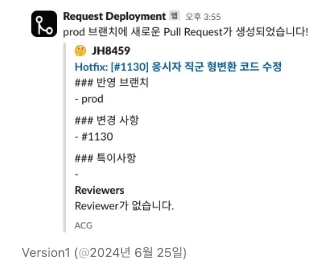
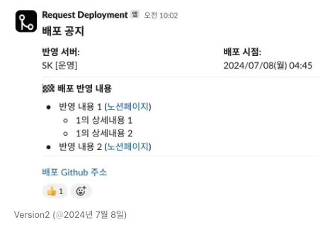
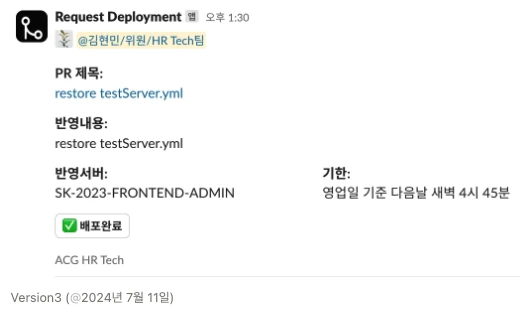
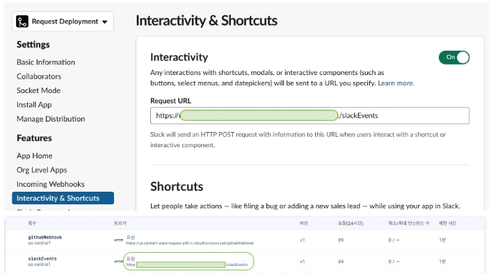

## 배경: 수동 배포의 불편함

테스트 서버는 GitHub Actions CI/CD 설정이 되어 있었지만, 안전(?)상의 이유로 운영 서버는 **사람이 직접 배포하는 방식**이었습니다.

직접 배포하다 보니 다음과 같은 불편함이 생겼습니다:

1. **일일이 배포 요청을 해야 함**
   - 구두로 요청하거나 메신저로 따로 알려야 함
   - 담당자가 요청을 놓치는 경우 발생

2. **배포 완료 여부 확인이 어려움**
   - 배포가 완료되었는지 확인하기 위해 별도로 물어봐야 함
   - 배포 진행 상태를 알 수 없음

조금이나마 이런 불편함을 개선하고자 Slack 앱을 만들어 보았습니다.

## 동작 흐름

### 전체 워크플로우

```
개발자 PR 생성 (prod 브랜치)
  → GitHub Webhook 발동
  → Firebase Functions 실행
  → Slack 채널에 배포 요청 알림 전송
  → 배포 담당자 확인
  → "배포 예정" 버튼 클릭
  → Slack 메시지 업데이트 (배포 상태 표시)
```

### 세부 동작

1. **개발자**: 개발을 완료하면 GitHub `prod` 브랜치에 Pull Request 생성
2. **Slack 알림**: 배포 담당자가 자동으로 전송된 배포 요청 알림 메시지 확인
3. **상태 업데이트**: 배포를 완료하면 `배포 예정` 버튼을 클릭해 배포 상태 표시

## 개발 과정

### 1. Firebase Functions 배포

먼저 GitHub Webhook을 받아서 처리할 Firebase Functions를 작성합니다.

```javascript
const functions = require('firebase-functions');
const axios = require('axios');

exports.githubWebhook = functions.https.onRequest(async (req, res) => {
  try {
    // GitHub Webhook 데이터 확인
    const { action, pull_request } = req.body;

    // prod 브랜치에 대한 PR만 처리
    if (pull_request && pull_request.base.ref === 'prod' && action === 'opened') {
      const prData = {
        title: pull_request.title,
        author: pull_request.user.login,
        url: pull_request.html_url,
        number: pull_request.number
      };

      // Slack에 메시지 전송
      await sendSlackMessage(prData);
    }

    res.status(200).send('OK');
  } catch (error) {
    console.error('Error:', error);
    res.status(500).send('Error');
  }
});

async function sendSlackMessage(prData) {
  const slackWebhookUrl = process.env.SLACK_WEBHOOK_URL;

  const message = {
    text: `새로운 배포 요청이 있습니다!`,
    blocks: [
      {
        type: "section",
        text: {
          type: "mrkdwn",
          text: `*배포 요청*\n제목: ${prData.title}\n작성자: ${prData.author}`
        }
      },
      {
        type: "actions",
        elements: [
          {
            type: "button",
            text: { type: "plain_text", text: "배포 예정" },
            style: "primary",
            action_id: "deploy_scheduled"
          },
          {
            type: "button",
            text: { type: "plain_text", text: "PR 보기" },
            url: prData.url
          }
        ]
      }
    ]
  };

  await axios.post(slackWebhookUrl, message);
}
```

### 2. Slack 설정

Slack API 사이트에서 다음을 설정합니다:

- **Incoming Webhooks**: 활성화 및 채널 선택
- **Interactivity & Shortcuts**: Request URL에 Firebase Functions URL 입력
- 필요한 토큰 및 시크릿 키 발급:
  - `SLACK_WEBHOOK_URL`
  - `SLACK_SIGNING_SECRET`
  - `SLACK_BOT_TOKEN`

### 3. GitHub Webhook 설정

GitHub 저장소의 Settings에서 Webhook을 설정합니다:

1. **Settings → Webhooks → Add webhook**
2. **Payload URL**: Firebase Functions의 배포된 URL 입력
3. **Content type**: `application/json` 선택
4. **Events**: `Let me select individual events` → `Pull requests` 선택
5. **Active**: 체크

이렇게 설정하면 `prod` 브랜치에 PR이 생성될 때만 Webhook이 발동됩니다.

### 4. Slack Block Kit으로 UI 디자인

Slack 메시지의 레이아웃은 Block Kit을 사용하여 디자인합니다.

[Designing with Block Kit 공식 문서](https://api.slack.com/block-kit/designing)

## UI 버전 히스토리

### 버전 1 - 기본 텍스트 알림



_단순 텍스트 기반 알림_

### 버전 2 - 구조화된 레이아웃



_섹션과 필드를 활용한 정보 구조화_

### 버전 3 - 인터랙티브 버튼 추가 (최종)



_배포 상태를 관리할 수 있는 버튼 추가_

## 버튼 클릭 이벤트 구현 (Version 3)

### Slack API 버튼 이벤트 연동 방법

1. **blocks 안에 `type`을 `actions`으로 설정**
2. **`elements` 배열 안에 `action_id` 값을 지정** (가장 중요!)
3. **`@slack/bolt`로 `app` 생성 후 `app.action`의 첫 번째 인자로 `action_id` 값 전달**

### 트러블슈팅: 404 에러와의 전쟁

#### 문제 상황

```
Function execution took 132 ms, finished with status code: 404
```

Firebase Console에 로그가 찍히지 않는 문제가 발생했습니다.



_Slack API의 Interactivity & Shortcuts 설정 화면_

#### 시도 1: Request URL 불일치

**문제**: Firebase Functions에서 할당된 URL 주소를 Slack API의 **Interactivity & Shortcuts → Request URL**에 입력하는 값과 일치시켜야 했습니다.

애초에 `app.action`으로 진입을 못하는 상황이었습니다.

#### 시도 2: Receiver로 라우팅

```javascript
exports.slackEvents = functions.https.onRequest(receiver.app);
```

Routing을 해주는 `receiver`로 묶어 보았지만 같은 에러가 발생했습니다.

#### 시도 3: 의미 불명의 에러

```
TypeError: Cannot read properties of undefined (reading 'apply')
```

무슨 의미인지 알기 어려웠습니다. Slack App 초기화에 대한 내용만 나왔지만 같은 에러가 반복되었습니다.

#### 시도 4: 직접 처리 (최종 해결)

**결정**: `app.action`으로 라우팅을 못 찾는다면, `exports.slackEvents = functions.https.onRequest` 부분까지는 실행이 되니까 이 안에서 로직을 처리하자!

대신 `@slack/bolt`를 사용하지 않고, **직접 axios로 데이터를 받고 보내기로 결정**했습니다.

> `@slack/bolt` 사용 시 장점: `client.chat.update` 등의 API를 활용해 데이터를 보낼 수 있습니다.

하지만 실제 코드 양은 거의 차이가 없었으므로, **axios로 post 하기로 결정**했습니다.

### 해결 코드

```javascript
exports.slackEvents = functions.https.onRequest(async (req, res) => {
  try {
    // Slack 버튼 클릭 시 전송되는 payload 파싱
    const payload = JSON.parse(req.body.payload);

    if (payload.actions && payload.actions[0].action_id === 'deploy_scheduled') {
      // response_url을 사용하여 메시지 업데이트
      const responseUrl = payload.response_url;

      const updatedMessage = {
        replace_original: true,
        text: "배포가 예정되었습니다!",
        blocks: [
          {
            type: "section",
            text: {
              type: "mrkdwn",
              text: `*배포 예정* ✅\n담당자: ${payload.user.name}\n예정 시간: ${new Date().toLocaleString('ko-KR')}`
            }
          }
        ]
      };

      await axios.post(responseUrl, updatedMessage);
    }

    res.status(200).send('OK');
  } catch (error) {
    console.error('Error:', error);
    res.status(500).send('Error');
  }
});
```

### 핵심 해결 방법

`exports.slackEvents = functions.https.onRequest` 안에서 직접 `req.body.payload`를 확인할 수 있었고, 중요한 `response_url`을 찾을 수 있었습니다.

받은 `response_url`로 POST 요청을 하니 정상적으로 메시지가 업데이트되었습니다!

## 기술 스택

### 사용 기술

- **GitHub Webhooks** - PR 이벤트 감지
- **Firebase Functions** - 서버리스 백엔드
- **Slack API** - Block Kit, Incoming Webhooks, Interactive Components
- **Node.js + Axios** - HTTP 요청 처리

### 주요 개념

**GitHub Webhooks**
- 저장소에서 특정 이벤트 발생 시 지정된 URL로 POST 요청 전송
- Pull Request, Push, Issue 등 다양한 이벤트 지원

**Slack Block Kit**
- 풍부한 UI를 가진 메시지 작성 도구
- Sections, Actions, Buttons 등을 조합하여 인터랙티브한 메시지 생성

**Firebase Functions**
- 서버 없이 이벤트 기반 코드 실행
- HTTPS 트리거로 외부 Webhook 수신 가능

## 회고

### 배운 점

1. **Slack API의 두 가지 응답 방식**
   - Webhook URL을 통한 새 메시지 전송
   - `response_url`을 통한 기존 메시지 업데이트

2. **디버깅의 어려움**
   - Firebase Functions는 로컬 테스트가 제한적
   - Slack Interactivity는 공개 URL이 필요해 로컬 모드 실행 불가
   - 계속 배포하면서 디버깅해야 했던 고충

3. **라이브러리 vs 직접 구현**
   - `@slack/bolt`가 편리하지만, Firebase Functions와 함께 사용 시 라우팅 이슈 발생
   - 때로는 axios로 직접 구현하는 것이 더 단순하고 명확함

4. **GitHub Webhook 필터링**
   - 브랜치 정보를 활용해 `prod` 브랜치 PR만 처리
   - 불필요한 알림을 줄여 노이즈 감소

### 개선점

**현재 문제**
- `@slack/bolt`에서 Firebase Functions로 거쳐서 요청하다 보니 디버깅이 어려움
- Slack Interactivity 부분은 로컬 모드로 실행하지 못해 계속 배포하면서 테스트

**개선 아이디어**

1. **로컬 디버깅 환경 구축**
   - ngrok를 활용한 로컬 터널링
   - Firebase Emulator Suite 활용

2. **배포 상태 세분화**
   - 배포 예정 → 배포 중 → 배포 완료 단계 구분
   - 각 단계별 버튼 추가

3. **알림 확장**
   - 배포 완료 시 자동 알림
   - 배포 실패 시 롤백 버튼 추가
   - 배포 이력 조회 기능

4. **슬랙봇 권한 관리**
   - 특정 사용자만 배포 버튼 클릭 가능하도록 권한 설정

### 성과

- **배포 요청 누락 제로**: 모든 PR이 자동으로 Slack에 알림
- **배포 상태 가시성 향상**: 버튼 클릭으로 배포 진행 상태 공유
- **커뮤니케이션 효율화**: 별도 메신저 없이 Slack에서 모든 것 처리

## 참고 자료

- [Slack Block Kit 디자인 가이드](https://api.slack.com/block-kit/designing)
- [GitHub Webhooks 문서](https://docs.github.com/en/developers/webhooks-and-events/webhooks)
- [Firebase Functions HTTP 트리거](https://firebase.google.com/docs/functions/http-events)
- [Slack Interactive Components](https://api.slack.com/interactivity)

---

**관련 글**
- [노션 업무 템플릿 개발기 #2 - Slack 연동 자동화](/devLog/notion-workflow-2)에서 비슷한 Slack 앱 개발 경험을 다루고 있습니다.
