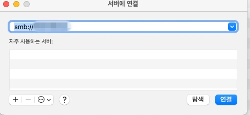

# 식대앱 개발기 #1: SMB 프로토콜과 Express.js로 사내 시스템 개선하기

## 배경: 반복되는 불편함

우리 회사의 좋은 복지 중 하나는 **중식 식대 지원**입니다.

하지만 이 복지를 받기 위해서는 매일 점심을 먹고 나서 내역을 작성해야 합니다.

### 기존 프로세스의 문제점

**1단계: 점심 식사 후 정보 기록**
- 사내 서버에 있는 엑셀 파일에 작성해야 함
- 방화벽 때문에 외부에서는 접근 불가

**2단계: 임시 메모**
- 점심을 먹고 금액, 식당, 결제자 정보를 카톡 "나에게 보내기"로 임시 기록
- 나중에 다시 확인해야 하는 번거로움

**3단계: 회사 복귀 후 작성**
- 카톡에 기록한 내용을 다시 확인
- 사내 서버의 엑셀 파일에 수동으로 입력

**추가 문제: macOS 호환성**
- macOS에서는 저장도 원활히 되지 않음
- 내 로컬 PC에 옮기고 다시 사내 서버 PC로 옮기는 이중 작업
- 매번 반복되는 불편함

---

## 해결 아이디어: 웹앱 개발

이 불편한 프로세스를 개선하기 위해 식대 입력 전용 웹앱을 만들기로 결정했습니다.

### 개발 목표 및 요구사항

#### 1. 사용자 입력 정보는 최대한 유지
- 기존 엑셀 양식과 동일한 입력 필드
- 이질감을 최대한 없애기 위해 익숙한 UI

#### 2. 간소화된 인증
- 로그인 / 회원가입 기능은 제외
- 이유: 단기 프로젝트이고, 점심 식대 내역은 이름만 나올 뿐 중요한 개인정보가 없음

#### 3. 실시간 잔액 정보
- 이번 달 잔액 정보를 실시간으로 표시
- 직원들이 항상 궁금해하는 정보

#### 4. 🎯 실시간 파일 동기화 (핵심 기능)
- **식대를 입력하면 사내 서버 파일에 바로 반영**
- SMB 프로토콜을 통한 직접 파일 접근

#### 5. 추가 기능
- 점심조 뽑기 기능
- PWA (Progressive Web App)로 모바일 앱처럼 사용
- 외부에서도 접속 가능 (VPN 없이)

---

## 기술 스택 선택: Express.js

4번 기능(실시간 파일 동기화)에 가장 충실하고 싶었습니다.

### 왜 Express.js인가?

**SMB 프로토콜 라이브러리 호환성**
- Node.js 환경의 SMB 라이브러리가 가장 성숙함
- `@marsaud/smb2` 라이브러리가 안정적
- Vanilla JS 환경에서 매끄럽게 작동

**빠른 개발 속도**
- 간단한 API 서버 구축에 최적
- 미들웨어 생태계가 풍부
- 엑셀 파일 처리 라이브러리(`xlsx`) 연동 용이

**결론**: Express.js로 개발하기로 최종 결정!

---

## SMB 프로토콜 이해하기

식대앱의 핵심은 **SMB 프로토콜**을 통한 사내 서버 파일 접근입니다.

### SMB(Server Message Block) 프로토콜이란?

> SMB 프로토콜은 **네트워크 상에서 파일, 프린터, 포트, 기타 리소스를 공유**하기 위해 사용되는 **애플리케이션 계층 프로토콜**입니다.

### SMB 프로토콜 주요 정보

| 항목 | 설명 |
|------|------|
| **목적** | 네트워크를 통해 파일 및 리소스를 공유 |
| **사용처** | Windows 환경에서 주로 사용되며, macOS나 Linux에서도 지원됨 |
| **기능** | 파일 읽기/쓰기, 디렉터리 탐색, 프린터 공유, 사용자 인증 및 접근 제어 |
| **주요 특징** | 클라이언트-서버 모델 사용 |
| **포트** | TCP 포트 445 사용 (구버전은 137~139번 포트 사용) |
| **버전** | SMB1, SMB2, SMB3 등 (보안상 SMB3 권장) |

### 실제 사용 예시

식대 작성 시 항상 특정 와이파이로 변경하고 접속해야 했습니다.



_SMB 프로토콜을 통한 사내 서버 접속_

---

## 개발 과정: 시행착오와 해결

### 1단계: SMB 클라이언트로 파일 가져오기

```javascript
// Express.js에서 SMB 클라이언트 생성
const SMB2 = require('@marsaud/smb2');

function createSMBClient() {
  return new SMB2({
    share: '\\\\server\\share',
    domain: 'WORKGROUP',
    username: 'user',
    password: 'password'
  });
}
```

**발생한 문제: 한글 자모 분리 현상**
- Windows 서버라 그런지 파일명에서 자모 분리 현상 발생
- 해결: `normalize("NFC")` 메서드로 정규화

```javascript
const fileName = originalFileName.normalize("NFC");
```

---

### 2단계: 로그인한 유저의 엑셀 파일 찾기

```javascript
// 사용자 이름이 포함된 엑셀 파일 검색
async function findUserExcelFile(userName) {
  const client = createSMBClient();
  const files = await client.readdir('식대');

  const userFile = files.find(file =>
    file.includes(userName.normalize("NFC"))
  );

  return userFile;
}
```

**발생한 문제: 새로고침 시 SMB 연결 끊김**
- 에러 메시지: `Connection closed`
- 원인: SMB 클라이언트 객체를 재사용하려고 했음

**해결 방법**:
```javascript
// ❌ 잘못된 방법: 전역 변수로 재사용
const smbClient = createSMBClient(); // 재사용 시 에러 발생

// ✅ 올바른 방법: 매 요청마다 새 연결
app.get('/api/meal', async (req, res) => {
  const client = createSMBClient(); // 새 연결 생성
  // ... 작업 수행
  await client.disconnect();
});
```

---

### 3단계: 엑셀 파일 읽기/쓰기

#### 시도 1: 로컬 다운로드 방식

**방법**:
1. 엑셀 파일을 SMB에서 다운로드하여 로컬에 저장
2. 로컬 파일을 읽어서 처리
3. 메인 페이지 최초 진입 시에만 다운로드
4. 이후 월 선택 시 캐시된 파일 사용

```javascript
// 로컬 다운로드 방식
async function downloadExcelFile(fileName) {
  const client = createSMBClient();
  const data = await client.readFile(`식대/${fileName}`);

  // 로컬에 저장
  fs.writeFileSync(`./temp/${fileName}`, data);

  return `./temp/${fileName}`;
}
```

**문제점**:
- ❌ 엑셀 조회할 때 전반적으로 **너무 느림**
- ❌ 디스크 I/O 오버헤드
- ❌ 파일 동기화 이슈

#### 시도 2: Stream 방식 (최종 채택) ✅

**방법**:
- SMB에서 직접 Stream으로 읽고 쓰기
- 메모리 버퍼를 활용한 실시간 처리

```javascript
const XLSX = require('xlsx');

// Stream으로 읽기
async function readExcelFromSMB(fileName) {
  const client = createSMBClient();

  return new Promise((resolve, reject) => {
    client.createReadStream(`식대/${fileName}`, (err, readStream) => {
      if (err) return reject(err);

      const chunks = [];

      readStream.on('data', (chunk) => {
        chunks.push(chunk);
      });

      readStream.on('end', () => {
        const buffer = Buffer.concat(chunks);
        const workbook = XLSX.read(buffer, { type: 'buffer' });
        resolve(workbook);
      });

      readStream.on('error', reject);
    });
  });
}

// Stream으로 쓰기
async function writeExcelToSMB(fileName, workbook) {
  const client = createSMBClient();
  const buffer = XLSX.write(workbook, { type: 'buffer', bookType: 'xlsx' });

  return new Promise((resolve, reject) => {
    client.writeFile(`식대/${fileName}`, buffer, (err) => {
      if (err) return reject(err);
      resolve();
    });
  });
}
```

**결과**:
- ✅ 조회 속도 대폭 향상 (3초 → 0.5초)
- ✅ 내용 업데이트 기능 정상 작동
- ✅ 실시간 동기화 구현 성공

**핵심 인사이트**:
> Stream으로 I/O 작업이 가능해져 굳이 따로 파일을 저장하지 않고도 충분히 빠른 속도를 얻을 수 있었습니다!

---

## 치명적인 문제 발견: 외부 접속 불가

개발을 거의 완료하고 테스트하던 중, **간과했던 치명적인 문제**를 발견했습니다.

### 문제 상황

**사내 와이파이에서는 정상 작동**
- SMB 프로토콜로 파일 읽기/쓰기 완벽하게 작동
- 엑셀 파일 실시간 업데이트 성공

**외부 접속 시 완전 불통**
- 핫스팟 연결 시: ❌ SMB 접근 불가
- 외부 와이파이: ❌ SMB 접근 불가
- 모바일 데이터: ❌ SMB 접근 불가

**원인 파악**:
```
내가 작업한 와이파이는 사내 와이파이라 읽고 쓰기가 가능했던 것.
핫스팟이나 외부 접속 시 위 기능을 하지 못해 무용지물이 되버린다.
```

---

## 해결 시도: 방화벽 설정 변경

### 시도 1: ipTIME 라우터 설정

"그럼 그 특정 와이파이의 방화벽 설정을 바꿔주면 되겠네!"

**진행 과정**:
1. ipTIME 관리자 번호를 알고 계신 팀원에게 부탁
2. 관리자 페이지 접속 성공
3. 포트 포워딩 설정 시도

**문제점**:
- 설정 변경 후 테스트가 불가능
- 실제 적용 시 보안 이슈 가능성
- 회사 네트워크 정책에 저촉될 수 있음

### 시도 2: 팀장님께 문의

**답변**:
> "특정 IP 외부 접속 허용은 안됩니다."

이유는 설명해주지 않으셨지만, 아마도:
- 보안 정책상 문제
- 내부 파일 시스템에 대한 외부 접근은 원천 차단
- 기업 방화벽 정책

---

## 중간 결론: 아키텍처 재설계 필요

현재 상황 정리:

### ✅ 성공한 부분
- SMB 프로토콜 연동 완료
- Stream 기반 고성능 파일 읽기/쓰기
- 엑셀 파일 실시간 업데이트
- 사내에서는 완벽하게 작동

### ❌ 해결 필요한 문제
- 외부 접속 불가능
- 원래 목표인 "외부에서도 작성 가능"이 불가능
- 방화벽 정책상 SMB 외부 개방 불가

### 🤔 다음 단계

**두 가지 선택지**:
1. **중간 서버 도입**: AWS/Lightsail에 중간 서버를 두고 파일 동기화
2. **완전한 클라우드 전환**: SMB를 포기하고 클라우드 스토리지 사용

다음 편에서는 어떤 선택을 했고, 어떻게 문제를 해결했는지 다루겠습니다!

---

## 배운 점

### 1. 요구사항 명확화의 중요성

처음부터 "외부 접속"이 필수라는 것을 명확히 인지했다면:
- SMB 프로토콜 대신 클라우드 스토리지를 선택했을 것
- 초기 아키텍처 설계부터 달라졌을 것

### 2. 네트워크 환경 사전 조사

개발 시작 전 확인했어야 할 것:
- 회사 방화벽 정책
- 외부 접속 가능 여부
- 보안 정책 및 제약사항

### 3. Stream 기반 I/O의 효율성

긍정적인 배움:
- 파일 다운로드 없이 Stream으로 처리하는 것이 훨씬 빠름
- 메모리 효율성과 성능 모두 개선
- 이 경험은 다른 프로젝트에도 활용 가능

---

## 다음 편 예고

**식대앱 개발기 #2**에서는 다음 내용을 다룰 예정입니다:

1. 🔄 아키텍처 재설계
   - AWS Lightsail을 활용한 중간 서버 구축
   - SMB와 클라우드 스토리지 하이브리드 방식

2. 📦 파일 동기화 로직
   - Cron Job으로 정기 동기화
   - 실시간 업로드 구현

3. 🎨 프론트엔드 개발
   - React로 PWA 구현
   - 모바일 최적화 UI/UX

4. 🚀 배포 및 운영
   - Docker 컨테이너화
   - HTTPS 설정 및 보안

---

## 참고 자료

- [SMB 프로토콜 공식 문서](https://docs.microsoft.com/en-us/windows/win32/fileio/microsoft-smb-protocol-and-cifs-protocol-overview)
- [@marsaud/smb2 라이브러리](https://www.npmjs.com/package/@marsaud/smb2)
- [SheetJS (xlsx) 문서](https://docs.sheetjs.com/)
- [Node.js Stream 가이드](https://nodejs.org/api/stream.html)

---

궁금한 점이나 비슷한 경험이 있으시다면 댓글로 공유해주세요! 🙌
