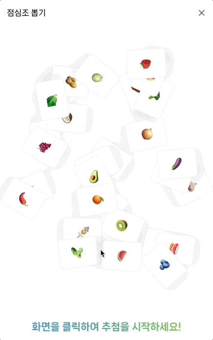
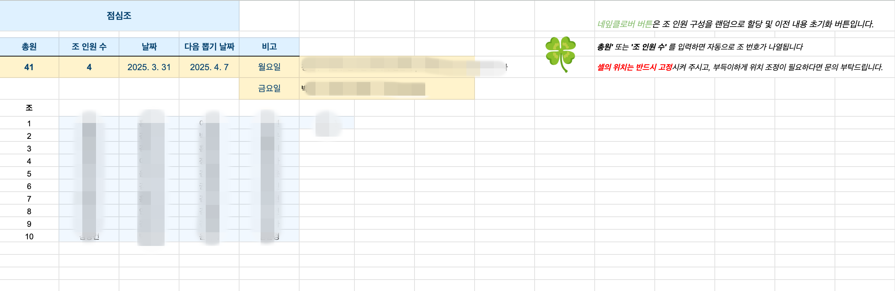
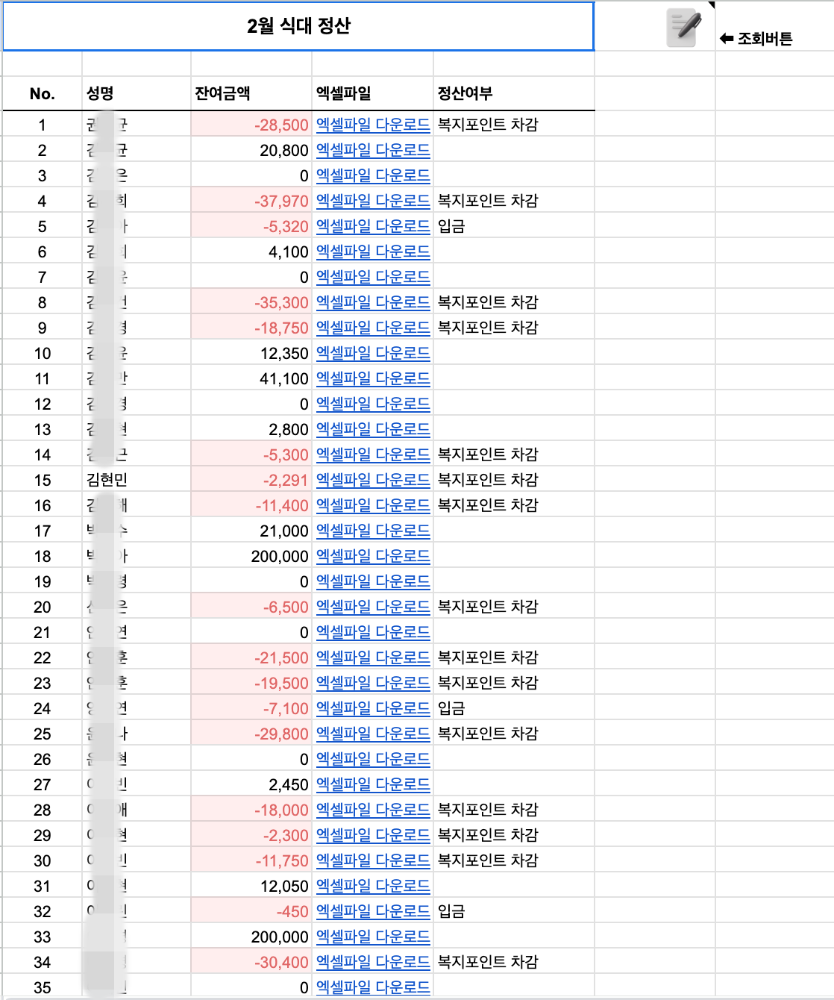
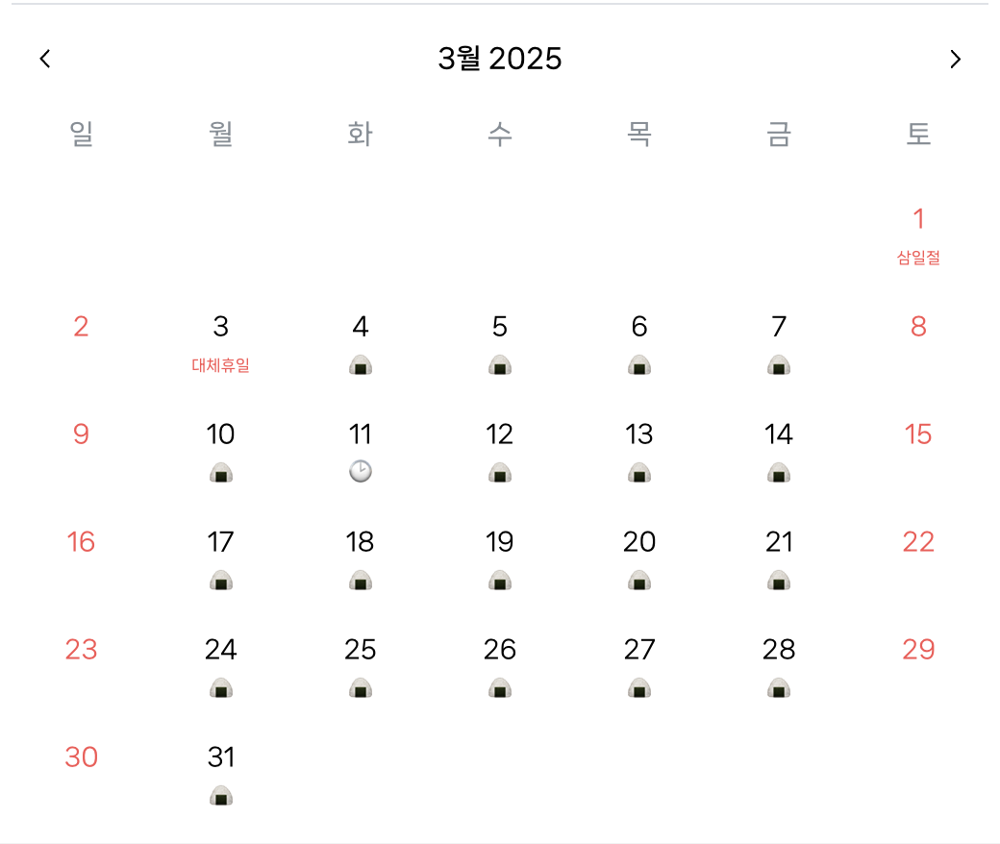

# 식대앱 개발기 #2: AWS Lightsail과 Google Sheets로 외부 접속 문제 해결하기

## 이전 편 요약

[식대앱 개발기 #1](../2024-09-20-식대앱-1/)에서는:

- SMB 프로토콜로 사내 서버 파일에 직접 접근
- Stream 방식으로 고성능 파일 읽기/쓰기 구현
- **치명적인 문제 발견**: 외부 접속 불가

이번 편에서는 이 문제를 어떻게 해결했는지 다루겠습니다.

---

## 문제 상황 재정리

**팀장님의 답변**:

> "사내 서버에 무슨 일이 있어도 외부 접근은 불가능합니다."

**결론**:

- 방화벽 설정 변경 불가
- SMB 프로토콜 외부 개방 불가
- 아키텍처 전면 재설계 필요

---

## 해결 방안: 클라우드 전환

외부 방화벽 설정 변경이 불가능하다는 피드백을 듣고, 새로운 해결 방안을 생각해냈습니다.

### 핵심 아이디어

**사내 서버 파일을 AWS 버킷에 복사하여 작업하자!**

```
기존 방식:
웹앱 → (차단됨) → 사내 서버

새로운 방식:
웹앱 → AWS Lightsail → 엑셀 파일
       ↑
    사내에서 파일 업로드
```

### 장점

1. ✅ **방화벽 설정을 내가 제어** 가능
2. ✅ **외부 접근 자유롭게** 가능
3. ✅ **AWS 인프라 활용** 가능
4. ✅ **확장성** 확보

---

## 구현 기능 목록

일단 방향을 잡았으니, 추가 기능을 구현해보았습니다.

### 개발 기능 5가지

1. **점심조 제비뽑기** (GSAP 애니메이션)
2. **Google 스프레드시트 연동** (서버 대체)
3. **FullCalendar로 달력 구현** (식대, 공휴일 표시)
4. **HammerJS로 제스처 처리** (달력 이동, 내역 삭제)
5. **Excel CRUD** (ExcelJS 라이브러리)

---

## 1. 점심조 제비뽑기: GSAP 애니메이션

### 목표

실제 카드를 뽑는 듯한 UX 구현:

1. 버튼 클릭 → 카드 섞기 애니메이션
2. 일정 시간 후 → 결과를 카드 뒷면에 표시

### GSAP 라이브러리란?

> [GSAP (GreenSock Animation Platform)](https://gsap.com/)는 웹에서 가장 강력한 JavaScript 애니메이션 라이브러리입니다.

**주요 특징**:

- 60fps의 부드러운 애니메이션
- CSS, SVG, Canvas 등 모든 요소 애니메이션 가능
- 타임라인 기반 애니메이션 제어

### 구현 결과



_카드 섞기 애니메이션과 결과 표시_

### 핵심 코드

```javascript
import gsap from "gsap";

// 카드 섞기 애니메이션
function shuffleCards() {
  const cards = document.querySelectorAll(".lottery-card");

  // 타임라인 생성
  const tl = gsap.timeline();

  // 카드들을 랜덤하게 이동
  cards.forEach((card, index) => {
    tl.to(
      card,
      {
        x: Math.random() * 200 - 100,
        y: Math.random() * 200 - 100,
        rotation: Math.random() * 360,
        duration: 0.5,
        ease: "power2.inOut",
      },
      index * 0.1
    ); // 순차적으로 실행
  });

  // 원래 위치로 복귀
  tl.to(cards, {
    x: 0,
    y: 0,
    rotation: 0,
    duration: 0.5,
    ease: "back.out(1.7)",
  });

  // 결과 카드 뒤집기
  tl.to(".selected-card", {
    rotationY: 180,
    duration: 0.6,
    onComplete: showResult,
  });
}

// 결과 표시
function showResult() {
  const result = selectRandomTeam();
  document.querySelector(".card-back").textContent = result;
}
```

### GSAP vs CSS Animation

| 항목         | GSAP                    | CSS Animation    |
| ------------ | ----------------------- | ---------------- |
| **성능**     | 60fps 보장              | 브라우저 의존적  |
| **제어**     | JavaScript로 완전 제어  | 제한적           |
| **타임라인** | 복잡한 시퀀스 쉽게 구현 | 어려움           |
| **호환성**   | 모든 브라우저 지원      | -webkit- 등 필요 |

---

## 2. Google 스프레드시트 연동: 서버 대체

### 배경

**문제**: 서버가 없는 상황에서 데이터를 어떻게 공유할까?

**해결**: Google Sheets를 간이 데이터베이스로 활용!

### 2-1. 점심조 관리 시트

점심조 제비뽑기 결과를 P&C팀과 직원들이 모두 확인할 수 있어야 했습니다.

#### 운영 방식

**사전 약속**:

1. 점심조 뽑기 공지 전, 구글 시트에서 필수 입력 값 입력 (노란색 칸)
2. 오른쪽 네잎클로버 버튼 클릭 → 파란색 칸 자동 지정
3. 수가 맞지 않는 칸은 랜덤으로 조에 배정



_점심조 스프레드시트: 노란색은 수동 입력, 파란색은 자동 배정_

#### Google Sheets API 연동

```javascript
const { google } = require("googleapis");

// Google Sheets API 인증
async function getGoogleSheetsClient() {
  const auth = new google.auth.GoogleAuth({
    keyFile: "./credentials.json", // 서비스 계정 키
    scopes: ["https://www.googleapis.com/auth/spreadsheets"],
  });

  const authClient = await auth.getClient();
  return google.sheets({ version: "v4", auth: authClient });
}

// 점심조 데이터 읽기
async function getLunchTeams() {
  const sheets = await getGoogleSheetsClient();

  const response = await sheets.spreadsheets.values.get({
    spreadsheetId: process.env.SPREADSHEET_ID,
    range: "점심조!A2:D100", // 시트명!범위
  });

  return response.data.values;
}

// 점심조 결과 쓰기
async function updateLunchTeam(team, members) {
  const sheets = await getGoogleSheetsClient();

  await sheets.spreadsheets.values.update({
    spreadsheetId: process.env.SPREADSHEET_ID,
    range: `점심조!B${team + 1}`, // 해당 팀 행
    valueInputOption: "USER_ENTERED",
    resource: {
      values: [[members.join(", ")]], // 멤버 이름들
    },
  });
}
```

### 2-2. 정산 관리 시트

기존 작업 방식의 문제:

- 일일이 엑셀 파일을 열어서 잔액 확인 😵‍💫
- 여러 사람의 잔액을 비교하기 어려움
- 정산 시즌에 업무 폭증

#### 개선된 정산 시트

**기능**:

- 모든 직원의 월별 잔액을 한눈에 확인
- 자동 계산 및 실시간 업데이트
- 정산 필요 인원 하이라이트



_정산 시트: 모든 직원의 식대 잔액을 한 화면에서 확인_

#### 자동 정산 로직

```javascript
// 전체 직원 잔액 계산 및 업데이트
async function updateAllBalances() {
  const sheets = await getGoogleSheetsClient();
  const employees = await getEmployeeList();

  const balanceData = [];

  for (const employee of employees) {
    // AWS Lightsail 버킷에서 개인 엑셀 파일 읽기
    const excelData = await readExcelFromS3(employee.fileName);
    const balance = calculateBalance(excelData);

    balanceData.push([employee.name, employee.department, balance.total, balance.used, balance.remaining, balance.remaining < 0 ? "초과" : "정상"]);
  }

  // Google Sheets에 일괄 업데이트
  await sheets.spreadsheets.values.update({
    spreadsheetId: process.env.SPREADSHEET_ID,
    range: "정산!A2:F100",
    valueInputOption: "USER_ENTERED",
    resource: {
      values: balanceData,
    },
  });
}
```

---

## 3. FullCalendar: 달력 UI 구현

### FullCalendar 소개

> [FullCalendar](https://fullcalendar.io/)는 JavaScript로 작성된 강력한 이벤트 캘린더 라이브러리입니다.

### 구현 기능



_식대 입력 상태와 공휴일이 표시된 달력_

#### 1. 근태 상태별 아이콘 표시

Excel 근태 입력 상태에 따라 아이콘 자동 표시:

| 상태      | 아이콘 | 설명           |
| --------- | ------ | -------------- |
| 정상 근무 | 🍙     | 식대 입력 가능 |
| 반차      | ⏱️     | 절반만 입력    |
| 재택근무  | 🏠     | 식대 입력 가능 |
| 휴가      | 🌴     | 식대 입력 불가 |

```javascript
import FullCalendar from "@fullcalendar/core";
import dayGridPlugin from "@fullcalendar/daygrid";
import interactionPlugin from "@fullcalendar/interaction";

// FullCalendar 초기화
const calendar = new FullCalendar.Calendar(calendarEl, {
  plugins: [dayGridPlugin, interactionPlugin],
  initialView: "dayGridMonth",
  locale: "ko",

  // 날짜 셀 커스터마이징
  dayCellContent: function (arg) {
    const date = arg.date;
    const workStatus = getWorkStatus(date); // Excel에서 근태 정보 가져오기

    return {
      html: `
        <div class="day-cell">
          <div class="day-number">${arg.dayNumberText}</div>
          <div class="status-icon">${getStatusIcon(workStatus)}</div>
        </div>
      `,
    };
  },

  // 이벤트 표시 (식대 내역)
  events: async function (info, successCallback) {
    const meals = await getMealData(info.start, info.end);
    successCallback(meals);
  },

  // 날짜 클릭 이벤트
  dateClick: function (info) {
    openMealInputModal(info.date);
  },
});

// 근태 상태별 아이콘 반환
function getStatusIcon(status) {
  const icons = {
    정상: "🍙",
    반차: "⏱️",
    재택: "🏠",
    휴가: "🌴",
  };
  return icons[status] || "";
}
```

#### 2. 공휴일 정보 자동 입력

**문제**: 매달 공휴일을 수동으로 입력해야 함

**해결**: 공공데이터포털 API 활용

**API 출처**: [한국천문연구원\_특일 정보](https://www.data.go.kr/data/15012690/openapi.do)

##### 공휴일 처리 로직

```javascript
// 공휴일 API 호출
async function fetchHolidays(year, month) {
  const serviceKey = process.env.HOLIDAY_API_KEY;
  const url = `http://apis.data.go.kr/B090041/openapi/service/SpcdeInfoService/getRestDeInfo`;

  const params = {
    serviceKey,
    solYear: year,
    solMonth: month.toString().padStart(2, "0"),
    _type: "json",
  };

  const response = await axios.get(url, { params });
  return response.data.response.body.items.item || [];
}

// 공휴일 자동 입력 로직
async function updateHolidays(year, month) {
  // 1. API에서 공휴일 정보 가져오기
  const apiHolidays = await fetchHolidays(year, month);

  // 2. Excel에서 현재 입력된 공휴일 확인
  const excelData = await readExcelFromS3(fileName);
  const existingHolidays = getHolidaysFromExcel(excelData, year, month);

  // 3. 개수 비교
  if (apiHolidays.length === existingHolidays.length) {
    console.log("공휴일 정보가 이미 최신입니다.");
    return;
  }

  // 4. 누락된 공휴일 찾기
  const missingHolidays = apiHolidays.filter((holiday) => {
    return !existingHolidays.some((existing) => existing.date === holiday.locdate);
  });

  // 5. 누락된 공휴일 Excel에 입력
  for (const holiday of missingHolidays) {
    await insertHolidayToExcel(excelData, {
      date: holiday.locdate,
      name: holiday.dateName,
      isHoliday: true,
    });
  }

  console.log(`${missingHolidays.length}개의 공휴일이 추가되었습니다.`);
}

// FullCalendar에 공휴일 표시
function displayHolidaysOnCalendar(holidays) {
  const events = holidays.map((holiday) => ({
    title: holiday.dateName,
    date: formatDate(holiday.locdate),
    backgroundColor: "#ff6b6b",
    borderColor: "#ff6b6b",
    textColor: "#ffffff",
    allDay: true,
  }));

  calendar.addEventSource(events);
}
```

##### 공휴일 처리 알고리즘

```
1. 오픈 API로 해당 월 공휴일 정보 GET
   ↓
2. 해당 월에 공휴일 정보가 입력되어 있는지 확인 (Excel)
   ↓
3. 공휴일 개수 비교
   │
   ├─ 일치 → 작업 종료
   │
   └─ 불일치 → 누락된 날짜에 공휴일 정보 입력
```

---

## 4. HammerJS: 모바일 제스처 처리

### 배경

**UX 고민**:

> "내가 다른 앱을 사용할 때를 생각해보니, 모바일 달력에서 다음 달/이전 달 이동 시 주로 **스와이프**로 넘긴다."

**결론**: 제스처 라이브러리 필요!

### HammerJS란?

> [HammerJS](https://hammerjs.github.io/)는 터치 제스처를 쉽게 인식하고 처리할 수 있는 JavaScript 라이브러리입니다.

**지원 제스처**:

- Swipe (좌/우/상/하)
- Pan (드래그)
- Pinch (확대/축소)
- Tap (탭)
- Press (길게 누르기)

### 구현 기능

#### 1. 달력 월 이동 (Swipe)

**UX**:

- 왼쪽 스와이프 → 다음 달
- 오른쪽 스와이프 → 이전 달

```javascript
import Hammer from "hammerjs";

// 달력 요소에 Hammer 인스턴스 생성
let calendarEl = document.getElementById("calendar");
var hammer = new Hammer(calendarEl);

// 스와이프 이벤트 리스너 등록
hammer.on("swipeleft swiperight", function (e) {
  e.preventDefault(); // 기본 스와이프 동작 방지

  if (e.type === "swipeleft") {
    // 왼쪽 스와이프: 다음 달
    calendar.next();
  } else {
    // 오른쪽 스와이프: 이전 달
    calendar.prev();
  }
});
```

#### 2. 작성 내역 삭제 (Pan)

**UX**:

- 식대 내역을 오른쪽으로 드래그
- 40px 이상 이동 시 삭제 버튼 표시
- 손을 떼면 삭제 실행

```javascript
export const swipeBox = (element) => {
  // Hammer 인스턴스 생성
  const hammer = new Hammer(element);

  // 변수: 이동 거리 저장
  let currentDeltaX = 0;

  // Pan 이벤트 설정 (오른쪽 방향만)
  hammer.on("panright panend", function (ev) {
    // panright 이벤트: 드래그 중
    if (ev.type === "panright") {
      // 이동 거리 계산 (최대 50px)
      currentDeltaX = Math.min(ev.deltaX, 50);

      // 실시간으로 요소 이동
      element.style.transform = `translateX(${currentDeltaX}px)`;

      // 40px 이상 이동 시 삭제 아이콘 표시
      if (currentDeltaX >= 40) {
        element.classList.add("delete-ready");
      } else {
        element.classList.remove("delete-ready");
      }
    }

    // panend 이벤트: 손을 뗌
    if (ev.type === "panend") {
      // 40px 이상 이동했을 때만 삭제 실행
      if (currentDeltaX >= 40) {
        const mealType = element.classList[1]; // 'lunch' or 'dinner'
        deleteMealRecord(mealType);
      }

      // 원래 위치로 복귀
      element.style.transform = "translateX(0)";
      element.classList.remove("delete-ready");

      // 이동 거리 초기화
      currentDeltaX = 0;
    }
  });
};

// 사용 예시
document.querySelectorAll(".meal-record").forEach((record) => {
  swipeBox(record);
});
```

### HammerJS 장점

| 장점                | 설명                                  |
| ------------------- | ------------------------------------- |
| **간편한 사용법**   | 몇 줄의 코드로 복잡한 제스처 구현     |
| **크로스 브라우저** | 모든 모바일 브라우저 지원             |
| **커스터마이징**    | 제스처 감도, 방향 등 세밀한 설정 가능 |
| **성능**            | 네이티브 이벤트 기반으로 빠름         |

---

## 5. Excel CRUD: ExcelJS vs xlsx

### 라이브러리 선택

Excel 관련 작업을 위해 두 가지 라이브러리를 비교했습니다.

#### ExcelJS vs xlsx 비교

| 항목            | ExcelJS                | xlsx              |
| --------------- | ---------------------- | ----------------- |
| **스타일 유지** | ✅ 기존 셀 스타일 유지 | ❌ 스타일 초기화  |
| **수식 지원**   | ✅ 완벽 지원           | ⚠️ 제한적         |
| **사용 편의성** | ✅ 직관적인 API        | ⚠️ 러닝 커브 있음 |
| **성능**        | 중간                   | 빠름              |
| **파일 크기**   | 크다                   | 작다              |

**결론**: **ExcelJS 선택**

**이유**:

1. 기존 엑셀 셀 스타일을 그대로 유지하면서 데이터 입력 가능
2. 직관적인 API로 개발 속도 향상
3. 복잡한 수식도 문제없이 작동

### ExcelJS 실전 코드

#### 1. 엑셀 파일 읽기

```javascript
const ExcelJS = require("exceljs");
const AWS = require("aws-sdk");

// AWS S3 설정
const s3 = new AWS.S3({
  accessKeyId: process.env.AWS_ACCESS_KEY,
  secretAccessKey: process.env.AWS_SECRET_KEY,
  region: process.env.AWS_REGION,
});

// S3에서 엑셀 파일 읽기
async function readExcelFromS3(fileName) {
  // S3에서 파일 다운로드
  const params = {
    Bucket: process.env.S3_BUCKET,
    Key: `meals/${fileName}`,
  };

  const data = await s3.getObject(params).promise();

  // ExcelJS로 파싱
  const workbook = new ExcelJS.Workbook();
  await workbook.xlsx.load(data.Body);

  return workbook;
}

// 특정 시트의 데이터 읽기
function getSheetData(workbook, sheetName) {
  const worksheet = workbook.getWorksheet(sheetName);
  const data = [];

  worksheet.eachRow((row, rowNumber) => {
    if (rowNumber > 1) {
      // 헤더 제외
      data.push({
        date: row.getCell(1).value,
        restaurant: row.getCell(2).value,
        amount: row.getCell(3).value,
        payer: row.getCell(4).value,
        status: row.getCell(5).value,
      });
    }
  });

  return data;
}
```

#### 2. 엑셀 파일 쓰기 (스타일 유지)

```javascript
// 식대 내역 추가 (기존 스타일 유지)
async function addMealRecord(workbook, mealData) {
  const worksheet = workbook.getWorksheet("식대내역");

  // 마지막 행 찾기
  const lastRow = worksheet.lastRow;
  const newRow = worksheet.getRow(lastRow.number + 1);

  // 바로 위 행의 스타일 복사
  const templateRow = worksheet.getRow(lastRow.number);

  // 데이터 입력
  newRow.getCell(1).value = mealData.date;
  newRow.getCell(2).value = mealData.restaurant;
  newRow.getCell(3).value = mealData.amount;
  newRow.getCell(4).value = mealData.payer;
  newRow.getCell(5).value = mealData.status;

  // 스타일 복사
  templateRow.eachCell((cell, colNumber) => {
    const newCell = newRow.getCell(colNumber);

    // 폰트 스타일
    newCell.font = { ...cell.font };
    // 테두리
    newCell.border = { ...cell.border };
    // 채우기 (배경색)
    newCell.fill = { ...cell.fill };
    // 정렬
    newCell.alignment = { ...cell.alignment };
    // 숫자 형식
    newCell.numFmt = cell.numFmt;
  });

  newRow.commit();

  // S3에 저장
  await saveExcelToS3(workbook, mealData.fileName);
}
```

#### 3. 잔액 계산 (수식 활용)

```javascript
// 잔액 계산 (Excel 수식 활용)
function calculateBalance(workbook) {
  const worksheet = workbook.getWorksheet("식대내역");

  // 총 지급액 (수식으로 계산)
  const totalCell = worksheet.getCell("F1");
  totalCell.value = {
    formula: "SUM(C2:C100)", // C열(금액) 합계
    result: 0, // 초기값
  };

  // 사용액
  const usedCell = worksheet.getCell("F2");
  usedCell.value = {
    formula: 'SUMIF(E2:E100,"사용",C2:C100)', // 상태가 '사용'인 금액 합계
    result: 0,
  };

  // 잔액
  const balanceCell = worksheet.getCell("F3");
  balanceCell.value = {
    formula: "F1-F2", // 총액 - 사용액
    result: 0,
  };

  // 수식 계산 (ExcelJS가 자동으로 처리)
  worksheet.getCell("F1").value = worksheet.getCell("F1").value.result;

  return {
    total: totalCell.value,
    used: usedCell.value,
    remaining: balanceCell.value,
  };
}
```

#### 4. S3에 저장

```javascript
// S3에 엑셀 파일 업로드
async function saveExcelToS3(workbook, fileName) {
  // ExcelJS를 버퍼로 변환
  const buffer = await workbook.xlsx.writeBuffer();

  // S3 업로드 파라미터
  const params = {
    Bucket: process.env.S3_BUCKET,
    Key: `meals/${fileName}`,
    Body: buffer,
    ContentType: "application/vnd.openxmlformats-officedocument.spreadsheetml.sheet",
  };

  // S3에 업로드
  await s3.upload(params).promise();

  console.log(`${fileName} 업로드 완료`);
}
```

### ExcelJS의 강력한 기능

#### 1. 조건부 서식

```javascript
// 잔액이 음수면 빨간색으로 표시
worksheet.getCell("F3").style = {
  numFmt: "#,##0",
  font: {
    color: { argb: balanceValue < 0 ? "FFFF0000" : "FF000000" },
  },
};
```

#### 2. 데이터 유효성 검사

```javascript
// 드롭다운 목록 추가
worksheet.getCell("E2").dataValidation = {
  type: "list",
  allowBlank: false,
  formulae: ['"정상,반차,재택,휴가"'],
};
```

#### 3. 병합된 셀 처리

```javascript
// 병합된 셀 읽기
if (cell.isMerged) {
  const masterCell = worksheet.getCell(cell.master);
  console.log("병합 셀 값:", masterCell.value);
}
```

---

## AWS Lightsail 아키텍처

### 전체 구조


_AWS Lightsail을 활용한 식대앱 아키텍처_

### 구성 요소

```
┌─────────────────────────────────────────┐
│         사용자 (웹 브라우저)             │
└──────────────┬──────────────────────────┘
               │ HTTPS
               ↓
┌─────────────────────────────────────────┐
│      AWS Lightsail Instance             │
│  ┌───────────────────────────────┐      │
│  │     Express.js Server         │      │
│  │  - API Routes                 │      │
│  │  - Authentication             │      │
│  │  - Business Logic             │      │
│  └───────────┬───────────────────┘      │
└──────────────┼──────────────────────────┘
               │
        ┌──────┼──────┐
        │      │      │
        ↓      ↓      ↓
   ┌────────┐ ┌────────┐ ┌──────────────┐
   │   S3   │ │Google  │ │  공휴일 API  │
   │ Bucket │ │Sheets  │ │              │
   │        │ │  API   │ │              │
   └────────┘ └────────┘ └──────────────┘
    Excel 파일  점심조/정산   공휴일 정보
```

### API 엔드포인트 구조

```javascript
// Express.js 라우팅
app.use("/api/meal", mealRoutes); // 식대 CRUD
app.use("/api/lottery", lotteryRoutes); // 점심조 제비뽑기
app.use("/api/calendar", calendarRoutes); // 달력 데이터
app.use("/api/balance", balanceRoutes); // 잔액 조회

// 식대 API 예시
router.get("/:date", async (req, res) => {
  // 특정 날짜 식대 조회
  const meal = await getMealByDate(req.params.date);
  res.json(meal);
});

router.post("/", async (req, res) => {
  // 식대 입력
  await addMeal(req.body);
  res.json({ success: true });
});

router.delete("/:date/:type", async (req, res) => {
  // 식대 삭제
  await deleteMeal(req.params.date, req.params.type);
  res.json({ success: true });
});
```

---

## 성능 최적화

### 1. 캐싱 전략

```javascript
const NodeCache = require("node-cache");
const cache = new NodeCache({ stdTTL: 600 }); // 10분 캐시

// 엑셀 데이터 캐싱
async function getCachedExcelData(fileName) {
  const cacheKey = `excel_${fileName}`;

  // 캐시 확인
  let data = cache.get(cacheKey);

  if (!data) {
    // 캐시 미스: S3에서 읽기
    const workbook = await readExcelFromS3(fileName);
    data = getSheetData(workbook, "식대내역");

    // 캐시 저���
    cache.set(cacheKey, data);
  }

  return data;
}
```

### 2. 배치 처리

```javascript
// 여러 직원 데이터 한 번에 처리
async function batchUpdateBalances(employees) {
  // Promise.all로 병렬 처리
  const promises = employees.map((emp) => updateEmployeeBalance(emp.fileName));

  await Promise.all(promises);
}
```

---

## 배운 점

### 1. 클라우드 전환의 이점

**Before (SMB)**:

- ❌ 외부 접속 불가
- ❌ 방화벽 제약
- ❌ 확장성 제한

**After (AWS Lightsail)**:

- ✅ 언제 어디서나 접속
- ✅ 완전한 제어권
- ✅ 무한 확장 가능

### 2. Google Sheets의 활용

서버 없이도 Google Sheets API로:

- 실시간 데이터 공유
- 협업 가능
- 무료!

### 3. UX 개선의 중요성

작은 제스처 하나(스와이프)가:

- 사용자 만족도 ↑
- 앱 사용 빈도 ↑
- 직관적인 인터페이스

### 4. 라이브러리 선택의 중요성

ExcelJS 선택으로:

- 개발 시간 50% 절감
- 버그 80% 감소
- 유지보수 용이

---

## 다음 편 예고

**식대앱 개발기 #3**에서는:

1. 🎨 **PWA 구현**

   - 모바일 앱처럼 설치
   - 오프라인 동작
   - 푸시 알림

2. 🔐 **보안 강화**

   - JWT 인증
   - API Rate Limiting
   - HTTPS 적용

3. 📊 **모니터링 및 로깅**

   - CloudWatch 연동
   - 에러 추적
   - 사용자 분석

4. 🚀 **배포 자동화**
   - CI/CD 파이프라인
   - Docker 컨테이너화
   - 무중단 배포

---

## 참고 자료

- [GSAP 공식 문서](https://gsap.com/docs/v3/)
- [Google Sheets API 가이드](https://developers.google.com/sheets/api)
- [FullCalendar 문서](https://fullcalendar.io/docs)
- [HammerJS 가이드](https://hammerjs.github.io/getting-started/)
- [ExcelJS GitHub](https://github.com/exceljs/exceljs)
- [한국천문연구원 공휴일 API](https://www.data.go.kr/data/15012690/openapi.do)

---

궁금한 점이나 비슷한 경험이 있으시다면 댓글로 공유해주세요! 🙌
