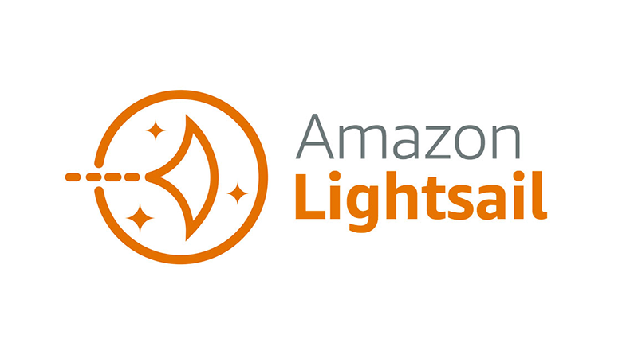

# 식대앱 개발기 #3: AWS Lightsail 배포와 HTTPS 적용 완벽 가이드

## 이전 편 요약

- [식대앱 개발기 #1](/devLog/app-log-1): SMB 프로토콜과 외부 접속 문제
- [식대앱 개발기 #2](/devLog/app-log-2): AWS 전환과 5가지 핵심 기능 구현

이번 편에서는 개발한 앱을 **실제로 배포하고 운영**하는 과정을 다루겠습니다.

---

## AWS Lightsail 선택 이유

동료분이 [AWS Lightsail](https://aws.amazon.com/ko/lightsail/)을 추천해주셔서 살펴보았는데, **클릭 몇 번만으로 간단하게 인스턴스 생성이 가능**했습니다.

### EC2 vs Lightsail 비교

| 항목 | AWS EC2 | AWS Lightsail |
|------|---------|---------------|
| **설정 복잡도** | 높음 (VPC, 보안그룹 등) | 낮음 (원클릭 설정) |
| **가격 체계** | 사용량 기반 (복잡) | 고정 요금제 (명확) |
| **대시보드** | 여러 곳에 분산 | 한 곳에 통합 |
| **초보자 친화성** | 낮음 | 높음 ✅ |
| **확장성** | 무한 | 제한적 |
| **적합한 경우** | 대규모 서비스 | 소규모 프로젝트 ✅ |

### Lightsail의 장점

1. **간편한 시작**: 버튼 몇 번으로 서버 생성
2. **명확한 가격**: 월 $3.5부터 시작
3. **통합 대시보드**: 도메인, S3, 데이터베이스 모두 한 곳에서 관리
4. **무료 데이터 전송**: 매월 1TB 무료 제공



_AWS Lightsail의 직관적인 관리 화면_

---

## 배포 준비 과정

어느 정도 기본적인 기능을 거의 개발한 뒤, 배포 작업만 남았습니다.

### 1단계: 엑셀 원본 파일 관리

**문제**: 엑셀 파일을 어디에 저장할 것인가?

**해결**: Lightsail Object Storage (S3 호환)에 업로드

```bash
# AWS CLI로 파일 업로드
aws lightsail put-bucket-object \
  --bucket-name meal-data \
  --key excel-files/employee1.xlsx \
  --content-file ./employee1.xlsx \
  --region ap-northeast-2
```

### 2단계: Ubuntu 인스턴스 생성

**Lightsail 인스턴스 스펙**:
- OS: Ubuntu 22.04 LTS
- Plan: $12/month (2GB RAM, 2 vCPU, 60GB SSD)
- Region: ap-northeast-2 (서울)

**초기 설정**:
```bash
# SSH 접속
ssh -i LightsailDefaultKey.pem ubuntu@[IP_ADDRESS]

# 시스템 업데이트
sudo apt update && sudo apt upgrade -y

# Node.js 18 설치
curl -fsSL https://deb.nodesource.com/setup_18.x | sudo -E bash -
sudo apt install -y nodejs

# Git 설치
sudo apt install -y git

# 프로젝트 클론
git clone https://github.com/yourusername/meal-app.git
cd meal-app
npm install
```

---

## PM2로 무중단 서비스 구축

**PM2**는 Node.js 애플리케이션의 프로세스 관리자입니다.

### PM2 설치 및 설정

```bash
# PM2 전역 설치
sudo npm install -g pm2

# 애플리케이션 시작
pm2 start server.js --name meal-app

# 자동 재시작 설정
pm2 startup systemd
sudo env PATH=$PATH:/usr/bin pm2 startup systemd -u ubuntu --hp /home/ubuntu

# 현재 프로세스 목록 저장
pm2 save
```

### PM2 Ecosystem 파일 작성

더 체계적인 관리를 위해 `ecosystem.config.js` 파일을 생성합니다.

```javascript
module.exports = {
  apps: [{
    name: 'meal-app',
    script: './server.js',
    instances: 2, // 클러스터 모드 (CPU 코어 활용)
    exec_mode: 'cluster',

    // 환경 변수
    env: {
      NODE_ENV: 'production',
      PORT: 3000,
      AWS_REGION: 'ap-northeast-2'
    },

    // 자동 재시작 조건
    max_memory_restart: '500M',

    // 로그 설정
    error_file: './logs/err.log',
    out_file: './logs/out.log',
    log_date_format: 'YYYY-MM-DD HH:mm:ss',

    // 모니터링
    merge_logs: true,

    // 재시작 정책
    watch: false,
    ignore_watch: ['node_modules', 'logs'],

    // Graceful reload
    kill_timeout: 5000,
    wait_ready: true,
    listen_timeout: 10000
  }]
};
```

**PM2 Ecosystem으로 시작**:
```bash
# ecosystem 파일로 시작
pm2 start ecosystem.config.js

# 상태 확인
pm2 status

# 로그 실시간 확인
pm2 logs meal-app

# 모니터링
pm2 monit
```

### PM2 주요 명령어

```bash
# 프로세스 관리
pm2 restart meal-app    # 재시작
pm2 reload meal-app     # 무중단 재시작 (클러스터 모드)
pm2 stop meal-app       # 중지
pm2 delete meal-app     # 삭제

# 모니터링
pm2 list                # 프로세스 목록
pm2 show meal-app       # 상세 정보
pm2 logs --lines 100    # 로그 확인

# 업데이트
pm2 update              # PM2 업데이트
pm2 reset meal-app      # 재시작 횟수 리셋
```

---

## CI/CD 파이프라인 구축

사내에서 CI/CD의 편리함을 경험한 후, 식대앱에도 적용하기로 결정했습니다.

### GitHub Actions 설정

**목표**: `main` 브랜치에 Push하면 자동으로 Lightsail 인스턴스에 배포

`.github/workflows/deploy.yml`:

```yaml
name: Deploy to AWS Lightsail

on:
  push:
    branches:
      - main

jobs:
  deploy:
    runs-on: ubuntu-latest

    steps:
      - name: Checkout code
        uses: actions/checkout@v3

      - name: Set up Node.js
        uses: actions/setup-node@v3
        with:
          node-version: '18'
          cache: 'npm'

      - name: Install dependencies
        run: npm ci

      - name: Run tests
        run: npm test

      - name: Build project
        run: npm run build

      - name: Deploy to Lightsail
        env:
          SSH_PRIVATE_KEY: ${{ secrets.SSH_PRIVATE_KEY }}
          LIGHTSAIL_IP: ${{ secrets.LIGHTSAIL_IP }}
        run: |
          # SSH 키 설정
          echo "${SSH_PRIVATE_KEY}" > deploy_key.pem
          chmod 600 deploy_key.pem

          # SSH 연결 테스트
          ssh -i deploy_key.pem -o StrictHostKeyChecking=no ubuntu@${LIGHTSAIL_IP} "echo SSH connection established"

          # 파일 동기화 (rsync)
          rsync -avz --exclude='node_modules' --exclude='.git' \
            -e "ssh -i deploy_key.pem -o StrictHostKeyChecking=no" \
            ./ ubuntu@${LIGHTSAIL_IP}:/home/ubuntu/meal-app

          # 원격 서버에서 배포 스크립트 실행
          ssh -i deploy_key.pem -o StrictHostKeyChecking=no ubuntu@${LIGHTSAIL_IP} << 'EOF'
            cd /home/ubuntu/meal-app
            npm ci --production
            pm2 reload ecosystem.config.js --update-env
            pm2 save
          EOF

          # 정리
          rm -f deploy_key.pem

      - name: Notify deployment success
        if: success()
        run: echo "✅ Deployment successful!"

      - name: Notify deployment failure
        if: failure()
        run: echo "❌ Deployment failed!"
```

### GitHub Secrets 설정

GitHub 저장소 Settings > Secrets and variables > Actions에서 추가:

1. **SSH_PRIVATE_KEY**: Lightsail SSH 개인 키
   ```bash
   # 로컬에서 키 내용 확인
   cat ~/.ssh/LightsailDefaultKey.pem
   ```

2. **LIGHTSAIL_IP**: Lightsail 인스턴스 고정 IP

### 배포 스크립트 개선

서버에 `deploy.sh` 스크립트를 추가하여 배포 자동화:

```bash
#!/bin/bash

# deploy.sh
set -e  # 에러 발생 시 중단

echo "🚀 Starting deployment..."

# 환경 변수 로드
source ~/.bashrc

# 최신 코드 가져오기
cd /home/ubuntu/meal-app
git pull origin main

# 의존성 설치
echo "📦 Installing dependencies..."
npm ci --production

# 데이터베이스 마이그레이션 (필요 시)
# npm run migrate

# PM2로 재시작 (무중단)
echo "♻️ Reloading application..."
pm2 reload ecosystem.config.js --update-env

# 헬스 체크
sleep 5
if pm2 list | grep -q "online.*meal-app"; then
  echo "✅ Deployment successful!"
  pm2 save
else
  echo "❌ Deployment failed! Rolling back..."
  git reset --hard HEAD~1
  pm2 reload ecosystem.config.js
  exit 1
fi

echo "🎉 Deployment completed!"
```

**스크립트 실행 권한 부여**:
```bash
chmod +x deploy.sh
```

---

## 도메인 연결: Nginx와 HTTPS 설정

### 1단계: 도메인 구매 및 DNS 설정

**Lightsail DNS 설정**:
- 최소 $0.50/month (월 300만 쿼리)
- 도메인: `meal.acg-playground.com`

**DNS 레코드 설정**:
```
Type: A
Name: meal
Points to: [Lightsail 인스턴스 고정 IP]
```

### 2단계: 방화벽 설정

Lightsail 네트워킹 탭에서 다음 포트 허용:

| 포트 | 프로토콜 | 용도 |
|------|----------|------|
| 22 | TCP | SSH |
| 80 | TCP | HTTP |
| 443 | TCP | HTTPS |
| 3000 | TCP | Node.js (선택) |

### 3단계: Nginx 설치 및 설정

**Nginx란?**
> 고성능 웹 서버이자 리버스 프록시 서버. 포트 포워딩, 로드 밸런싱, SSL 종료 등의 역할을 수행합니다.

**Nginx 설치**:
```bash
# Nginx 설치
sudo apt install nginx -y

# Nginx 시작 및 자동 시작 설정
sudo systemctl start nginx
sudo systemctl enable nginx

# 상태 확인
sudo systemctl status nginx
```

**Nginx 설정 파일 작성**:

`/etc/nginx/sites-available/meal-app`:

```nginx
server {
    listen 80;
    server_name meal.acg-playground.com;

    # 로그 설정
    access_log /var/log/nginx/meal-app-access.log;
    error_log /var/log/nginx/meal-app-error.log;

    # 클라이언트 요청 크기 제한 (엑셀 파일 업로드)
    client_max_body_size 10M;

    # 프록시 설정 (Node.js 앱으로 전달)
    location / {
        proxy_pass http://localhost:3000;
        proxy_http_version 1.1;

        # WebSocket 지원
        proxy_set_header Upgrade $http_upgrade;
        proxy_set_header Connection 'upgrade';

        # 헤더 전달
        proxy_set_header Host $host;
        proxy_set_header X-Real-IP $remote_addr;
        proxy_set_header X-Forwarded-For $proxy_add_x_forwarded_for;
        proxy_set_header X-Forwarded-Proto $scheme;

        # 타임아웃
        proxy_connect_timeout 60s;
        proxy_send_timeout 60s;
        proxy_read_timeout 60s;

        # 캐시 무효화
        proxy_cache_bypass $http_upgrade;
    }

    # 정적 파일 캐싱 (선택)
    location ~* \.(js|css|png|jpg|jpeg|gif|ico|svg|woff|woff2|ttf|eot)$ {
        proxy_pass http://localhost:3000;
        expires 1y;
        add_header Cache-Control "public, immutable";
    }

    # Gzip 압축
    gzip on;
    gzip_types text/plain text/css application/json application/javascript text/xml application/xml application/xml+rss text/javascript;
}
```

**설정 활성화**:
```bash
# 심볼릭 링크 생성
sudo ln -s /etc/nginx/sites-available/meal-app /etc/nginx/sites-enabled/

# 기본 설정 제거
sudo rm /etc/nginx/sites-enabled/default

# 설정 테스트
sudo nginx -t

# Nginx 재시작
sudo systemctl restart nginx
```

**접속 확인**:
```
http://meal.acg-playground.com
```

### 4단계: Let's Encrypt로 HTTPS 적용

**Certbot 설치**:
```bash
# Certbot 및 Nginx 플러그인 설치
sudo apt install certbot python3-certbot-nginx -y
```

**SSL 인증서 발급**:
```bash
# 인증서 자동 발급 및 Nginx 설정
sudo certbot --nginx -d meal.acg-playground.com
```

**Certbot 대화형 프롬프트**:
```
Please choose whether or not to redirect HTTP traffic to HTTPS:
-------------------------------------------------------------------------------
1: No redirect - Make no further changes to the webserver configuration.
2: Redirect - Make all requests redirect to secure HTTPS access.
-------------------------------------------------------------------------------
Select the appropriate number [1-2] then [enter]:
```

**✅ 선택**: `2` (HTTP를 HTTPS로 자동 리다이렉트)

**자동으로 추가된 Nginx 설정**:
```nginx
server {
    server_name meal.acg-playground.com;

    # ... 기존 설정 ...

    listen 443 ssl; # managed by Certbot
    ssl_certificate /etc/letsencrypt/live/meal.acg-playground.com/fullchain.pem;
    ssl_certificate_key /etc/letsencrypt/live/meal.acg-playground.com/privkey.pem;
    include /etc/letsencrypt/options-ssl-nginx.conf;
    ssl_dhparam /etc/letsencrypt/ssl-dhparams.pem;
}

# HTTP to HTTPS 리다이렉트
server {
    if ($host = meal.acg-playground.com) {
        return 301 https://$host$request_uri;
    }

    listen 80;
    server_name meal.acg-playground.com;
    return 404;
}
```

### 5단계: SSL 인증서 갱신 자동화

Let's Encrypt 인증서는 **90일**마다 갱신이 필요합니다.

**자동 갱신 타이머 확인**:
```bash
# Certbot 자동 갱신 타이머 상태 확인
sudo systemctl list-timers | grep certbot
```

**수동 갱신 테스트**:
```bash
# 드라이런 (실제 갱신 안 함)
sudo certbot renew --dry-run
```

**갱신 설정 커스터마이징**:

`/etc/letsencrypt/renewal/meal.acg-playground.com.conf`:
```ini
# 기존 설정...

[renewalparams]
# 만료 30일 전에 갱신
renew_before_expiry = 30 days

# 갱신 후 Nginx 자동 재시작
renew_hook = systemctl reload nginx

# 이메일 알림
email = your-email@example.com
```

**크론 작업 추가 (선택)**:
```bash
# crontab 편집
sudo crontab -e

# 매일 새벽 2시에 갱신 확인
0 2 * * * /usr/bin/certbot renew --quiet --post-hook "systemctl reload nginx"
```

---

## 최종 배포 완료

최종적으로 **https://meal.acg-playground.com** 도메인으로 서비스를 제공할 수 있게 되었습니다!

*(현재는 다른 도메인으로 마이그레이션한 상태)*

### 🎉 달성한 목표

1. ✅ **대표님 승인** - 전 직원 사용 허가
2. ✅ **언제 어디서나 접속** - 외부 접속 문제 해결
3. ✅ **편리한 식대 입력** - 카톡 메모 → 앱 직접 입력
4. ✅ **점심조 자동화** - 한 명씩 찾아다니지 않아도 됨
5. ✅ **정산 자동화** - 엑셀 일일이 열지 않아도 됨

---

## 개발 회고

### 예상보다 복잡했던 부분

**1. 기획 & 디자인**
> "정답이 없는 영역"이라는 것을 깨달았습니다.

- 사용자 플로우 설계
- UI/UX 고민
- 모바일 최적화
- 색상, 레이아웃 결정

**2. 인프라 설정**
> "도메인 하나 연결하는데 설정이 이렇게 많다니..."

- DNS 레코드 설정
- 방화벽 포트 허용
- Nginx 리버스 프록시
- SSL 인증서 발급
- 자동 갱신 설정

**3. 배포 자동화**
> "수동 배포는 이제 그만!"

- SSH 키 관리
- rsync 동기화
- PM2 클러스터 모드
- 무중단 배포

### 얻은 것들

#### 1. 기술 스택 확장

**Before**:
- 프론트엔드 개발만 경험
- AWS 미경험
- 배포 개념 부족

**After**:
- 풀스택 개발 경험 ✅
- AWS Lightsail 활용 ✅
- 인프라 구축 능력 ✅
- CI/CD 파이프라인 구축 ✅

#### 2. 실무 프로세스 이해

- 기획 → 디자인 → 개발 → 배포 → 운영
- 사용자 피드백 수렴
- 지속적인 개선

#### 3. 문제 해결 능력

- SMB 외부 접속 불가 → AWS 전환
- 성능 이슈 → 캐싱 전략
- 배포 번거로움 → CI/CD 구축

#### 4. 팀 커뮤니케이션

- 대표님 승인 과정
- 동료 피드백 반영
- 사용자 교육

---

## 성능 모니터링

배포 후 지속적인 모니터링이 필요합니다.

### PM2 모니터링

```bash
# 실시간 모니터링
pm2 monit

# 상�� 정보
pm2 show meal-app

# 메모리/CPU 사용량
pm2 list
```

### Nginx 로그 분석

```bash
# 실시간 액세스 로그
sudo tail -f /var/log/nginx/meal-app-access.log

# 에러 로그
sudo tail -f /var/log/nginx/meal-app-error.log

# 로그 분석 (GoAccess)
sudo apt install goaccess -y
sudo goaccess /var/log/nginx/meal-app-access.log --log-format=COMBINED
```

### 서버 리소스 모니터링

```bash
# CPU/메모리 사용량
htop

# 디스크 사용량
df -h

# 네트워크 트래픽
sudo iftop
```

---

## 비용 최적화

### 현재 월간 비용

| 항목 | 비용 |
|------|------|
| Lightsail 인스턴스 (2GB) | $12 |
| Lightsail Object Storage (5GB) | $1 |
| Lightsail DNS | $0.50 |
| 도메인 (연간 $12) | $1 |
| **총 월간 비용** | **$14.50** |

### 비용 절감 팁

1. **Lightsail 스냅샷 관리**
   ```bash
   # 오래된 스냅샷 삭제
   aws lightsail delete-instance-snapshot --snapshot-name old-snapshot
   ```

2. **S3 수명 주기 정책**
   - 90일 이상 된 파일 자동 삭제

3. **CDN 활용 (선택)**
   - Lightsail CDN으로 정적 파일 제공

---

## 다음 단계: 추가 개선 사항

### 1. 모니터링 강화

- [ ] CloudWatch 연동
- [ ] Slack 알림 연동
- [ ] 에러 트래킹 (Sentry)

### 2. 보안 강화

- [ ] JWT 인증 추가
- [ ] Rate Limiting
- [ ] SQL Injection 방어
- [ ] XSS 방어

### 3. 성능 최적화

- [ ] Redis 캐싱
- [ ] CDN 도입
- [ ] 이미지 최적화
- [ ] 데이터베이스 인덱싱

### 4. 기능 확장

- [ ] 모바일 앱 (React Native)
- [ ] 푸시 알림
- [ ] 통계 대시보드
- [ ] 관리자 페이지

---

## 배운 점 정리

### 핵심 교훈 5가지

1. **작은 것부터 시작하라**
   - MVP(Minimum Viable Product)로 시작
   - 점진적으로 기능 추가

2. **자동화는 필수다**
   - CI/CD로 배포 시간 90% 단축
   - 수동 작업은 에러의 원인

3. **사용자 피드백이 중요하다**
   - 실제 사용자 의견 반영
   - 지속적인 개선

4. **문서화를 게을리하지 말자**
   - 배포 프로세스 문서화
   - 트러블슈팅 가이드 작성

5. **모니터링과 로깅은 생명줄이다**
   - 문제 발생 시 빠른 대응
   - 성능 병목 지점 파악

---

## 마무리하며

### 프로젝트 통계

| 항목 | 수치 |
|------|------|
| 개발 기간 | 3주 |
| 코드 라인 수 | ~5,000 lines |
| 커밋 수 | 87 commits |
| 사용자 수 | 전 직원 (약 30명) |
| 일평균 접속 | ~50회 |
| 절감 시간 | 1인당 5분/일 |

### 감사의 말

- 🙏 동료분의 Lightsail 추천
- 🙏 대표님의 승인과 격려
- 🙏 직원분들의 피드백과 사용
- 🙏 막막했지만 끝까지 응원해준 모든 분들

간단할 줄만 알았던 프로젝트가 생각보다 복잡했지만, **막막함 속에서 UI/UX, 디자인, 배포 관련 지식을 쌓을 수 있는 좋은 기회**였습니다.

**칭찬과 격려 속에 프로젝트를 성공적으로 마무리**할 수 있었습니다. 🎉

---

## 참고 자료

### AWS Lightsail
- [AWS Lightsail 공식 문서](https://docs.aws.amazon.com/lightsail/)
- [Lightsail 가격 정책](https://aws.amazon.com/lightsail/pricing/)

### PM2
- [PM2 공식 문서](https://pm2.keymetrics.io/docs/)
- [PM2 Ecosystem 파일](https://pm2.keymetrics.io/docs/usage/application-declaration/)

### Nginx
- [Nginx 공식 문서](https://nginx.org/en/docs/)
- [Nginx 리버스 프록시 가이드](https://docs.nginx.com/nginx/admin-guide/web-server/reverse-proxy/)

### Let's Encrypt
- [Certbot 공식 문서](https://certbot.eff.org/)
- [Let's Encrypt 사용 가이드](https://letsencrypt.org/getting-started/)

### CI/CD
- [GitHub Actions 문서](https://docs.github.com/en/actions)
- [SSH 배포 가이드](https://github.com/appleboy/ssh-action)

---

## 시리즈 완결

식대앱 개발기 3부작이 완결되었습니다!

1. [#1: SMB 프로토콜과 Express.js](/devLog/app-log-1)
2. [#2: AWS Lightsail과 Google Sheets](/devLog/app-log-2)
3. **#3: 배포와 HTTPS 적용** (현재 글)

궁금한 점이나 비슷한 경험이 있으시다면 댓글로 공유해주세요! 🙌
