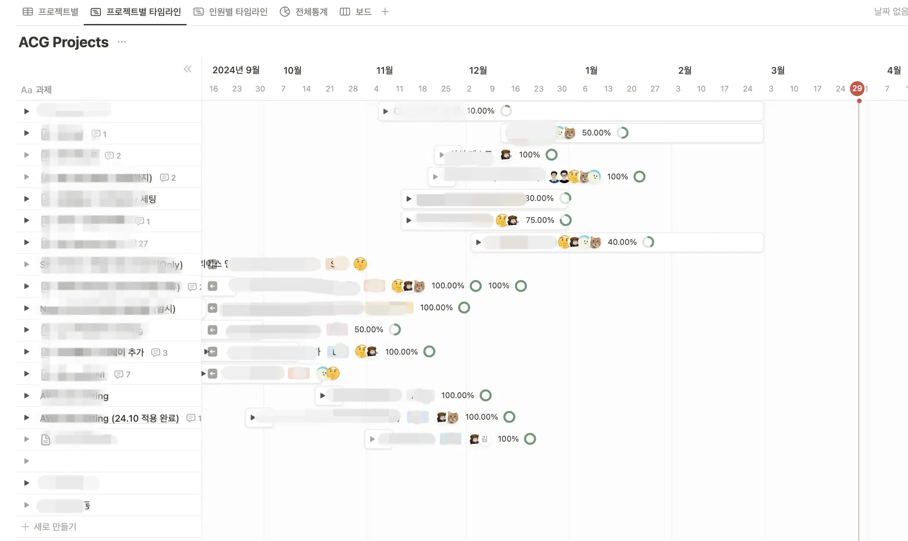
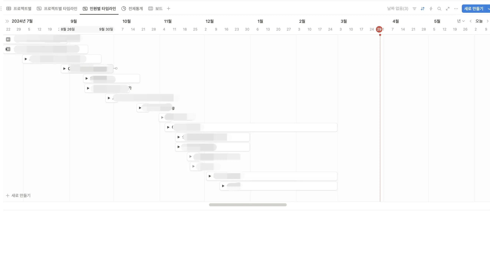
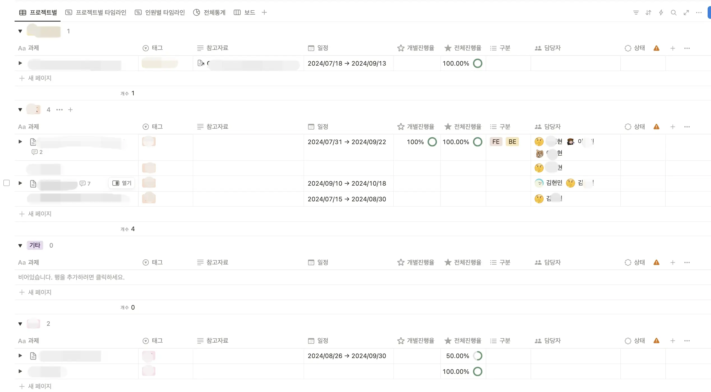
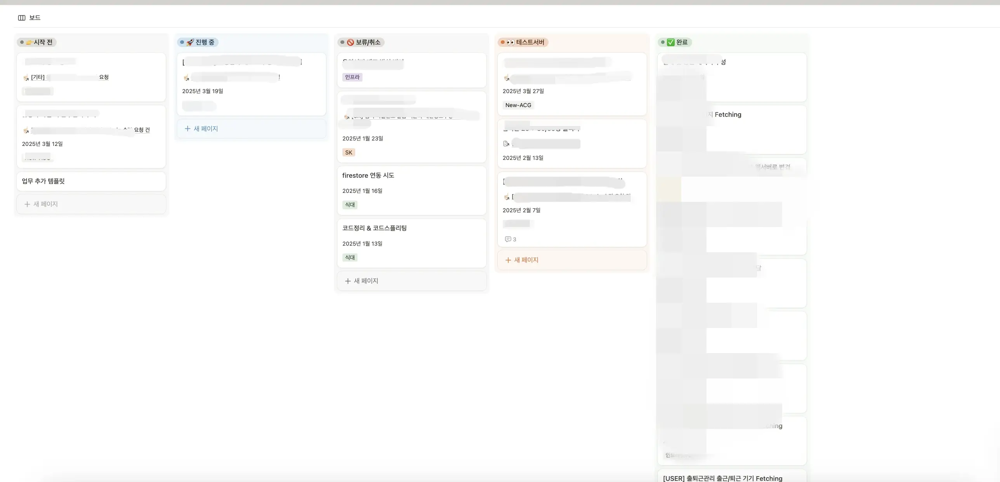
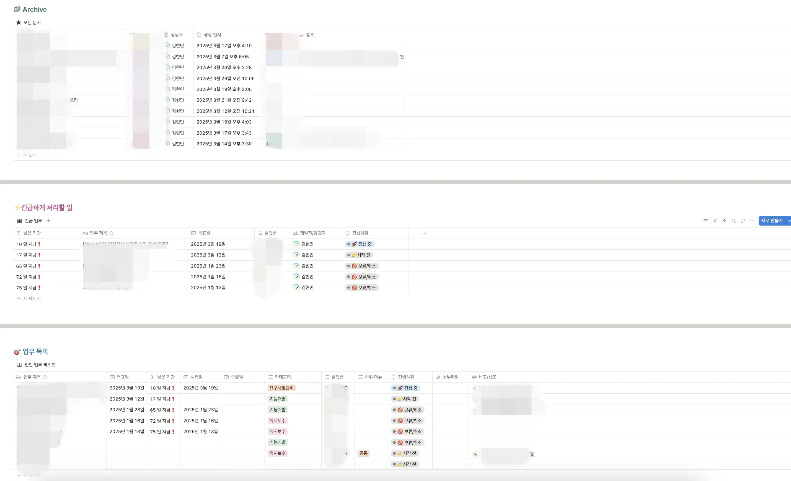

## 시작: 조직 개편과 새로운 요구사항

2025년 1월 2일, 조직 개편이 진행되면서 팀장님이 새로 임명되었습니다.

이전에는 팀장 없이 본부장님 직속으로 운영되던 구조였고, 본부장님도 2024년 하반기에 새로 오셨던 상황이었습니다.

이 프로젝트의 배경을 거슬러 올라가면, 작년 본부장님이 새로 오신 후부터 시작되었습니다. 원활한 업무 파악 및 진행을 위해 노션 템플릿 제작을 요청받았고, 그때부터 템플릿과의 긴 여정이 시작되었습니다.

## 초기 템플릿 설계

본부장님의 요구사항은 명확하지 않았고 수시로 변경되는 이슈가 있었지만, 우선 사용 가능한 형태로 템플릿을 만들었습니다.

### 실제 사용했던 초기 템플릿

_업무 현황 대시보드 형태의 초기 템플릿_

_업무 상태 및 진행률 추적 뷰_

_개별 업무 상세 정보 입력 폼_

## 문제점 분석

하지만 한 번에 모두의 입맛을 충족시킬 수는 없었습니다. 실제 운영 과정에서 다음과 같은 문제점들이 발견되었습니다.

### 1. 기록이 잡무가 됨

각자 진행한 업무에 대해 **업무 시작일, 완료일, 목표일, 상태** 등을 각각 직접 변경해야 하는 번거로움이 있었습니다. 이미 각자의 페이지에서 하고 있는 일을 중복으로 기록해야 했습니다.

특히 업무 진행 특성상 **"완료일이 완료일이 아닌 경우"** 가 매우 빈번하게 발생했기 때문에, 가장 심각한 문제였습니다.

### 2. 정확하지 않은 업무 진행률

1번 문제에서 파생된 이슈였습니다. 업무에 대한 완벽한 기준이 없었습니다.

고객사가 OK하면 완료입니다. 하지만 불만족인지, 만족인지, 끝이 난 건지 검토 중인지도 모를 업무들이 대다수였습니다.

본부장님도, 대표님도 어쩔 수 없는 **'을'의 위치**에서, 퍼센트로 진행률을 기록하는 것은 의미가 없다고 판단되었습니다.

### 3. 모호한 업무 기록 기준

각자 업무 기록에 대한 depth가 달랐습니다.

> "어느 업무 선까지 적어야 하는가?"

명확한 기준이 없었기 때문에 개인마다 기록 수준이 제각각이었습니다.

### 4. 관리의 책임

본부장님은 능동성을 내세우며 팀원들이 각자 작성해서 진행하기를 원하셨습니다.

하지만 저는 본부장님이 작성하는 것이 맞다고 판단했습니다. 그 이유는:

- 의사결정권자들과 가장 밀접하게 소통하는 분
- 팀원의 업무 상황, 정확한 일정을 수시로 파악해야 하는 분
- 팀을 이끌기 위해 가장 중요한 데이터를 관리해야 하는 위치

본부장님도 동의하셔서 이제 진행이 되려나 했지만... 노션 사용법을 알려드리는 시간이 생겼고, 업데이트는 느렸습니다.

### 5. 배보다 배꼽이 더 크다

요구사항은 많지만 기준은 정립되지 않아 모호했습니다.

결국 자동화된 무언가를 원하시는 것 같았지만, **GUEST 계정**에서는 불가능했습니다.

자동화를 위해 유료 결제를 요청했지만 반려되었습니다.

## 해결책: 팀 공용 템플릿

위의 문제들을 해결하기 위해 다음과 같은 방향으로 정리했습니다.

**→ 각자 페이지에 작성하는 테이블을 한 템플릿으로 통일하자**

### 제안한 팀 공용 템플릿

감사하게도 팀원 모두 긍정적인 의견을 주셨습니다.

_통일된 업무 기록 템플릿_

_개인 페이지에서 사용하는 템플릿 예시_

### 최종 운영 방식

- 각자 페이지에서 각자 업무를 템플릿에 작성
- 본부장님은 각 페이지에 들어가서 업무 일정 파악

## 추가 제안과 아쉬움

문서가 아닌 문서로 정확한 업무 파악과 이슈 공유가 어렵지 않을까 생각해서, 추가로 **주간 회의 시간**을 갖자고 제안했습니다.

하지만 한 번 진행하신 이후로는... 😨

## 다음 단계

이렇게 정리된 템플릿은 조직 개편 이후 팀장님이 오시면서 또 다른 변화를 맞이하게 됩니다.

[노션 업무 템플릿 개발기 #2 - Slack 연동 자동화](/devLog/notion-workflow-2)에서 자동화 과정을 이어서 다룹니다.

## 회고

### 배운 점

1. **요구사항의 명확화가 가장 중요하다**
   - 모호한 요구사항은 결국 누구도 만족시키지 못하는 결과를 낳습니다.

2. **관리 책임의 명확화**
   - 누가 업데이트하고 관리할 것인지 명확히 해야 템플릿이 살아있습니다.

3. **기준의 중요성**
   - "어디까지 기록할 것인가"에 대한 명확한 기준이 필요합니다.

4. **도구의 한계 인정**
   - 무료 계정의 한계를 인정하고 그 안에서 최선을 찾아야 합니다.

### 아쉬운 점

- 자동화를 위한 유료 계정 승인이 되지 않아 수작업이 불가피했습니다.
- 주간 회의 같은 커뮤니케이션 채널이 지속되지 못했습니다.
- 완료 기준에 대한 명확한 정의를 내리지 못했습니다.

---

**시리즈 글**
- 노션 업무 템플릿 개발기 #1 - 팀 생산성을 위한 템플릿 설계 (현재 글)
- [노션 업무 템플릿 개발기 #2 - Slack 연동 자동화](/devLog/notion-workflow-2)
