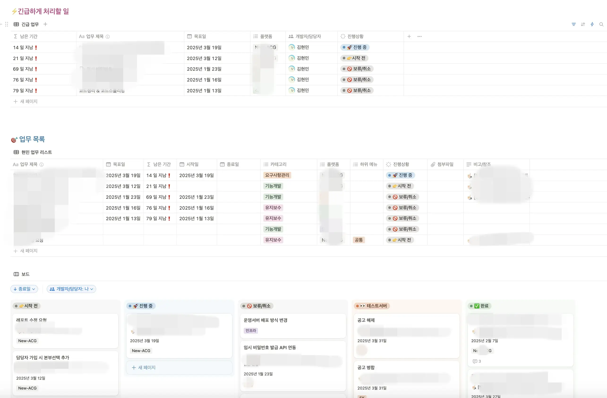
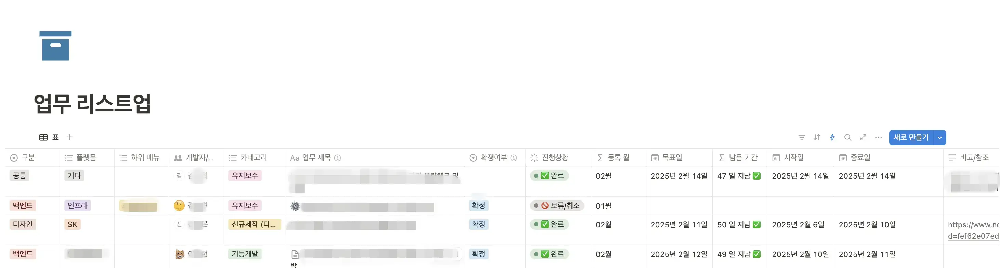
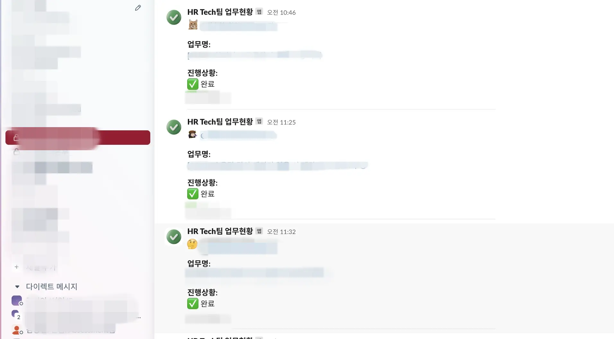
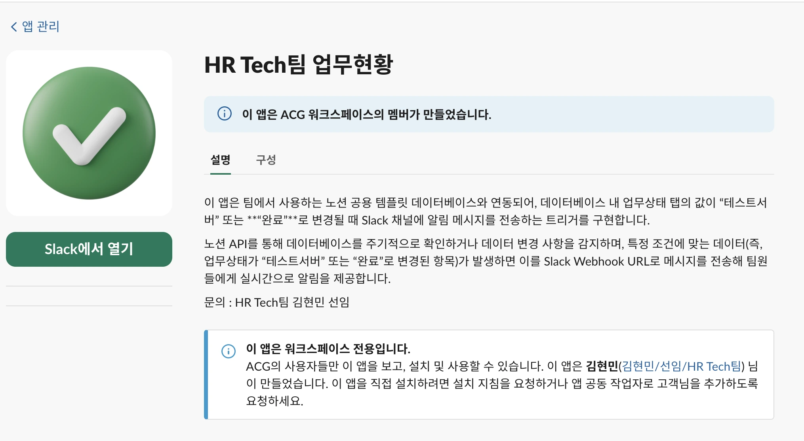
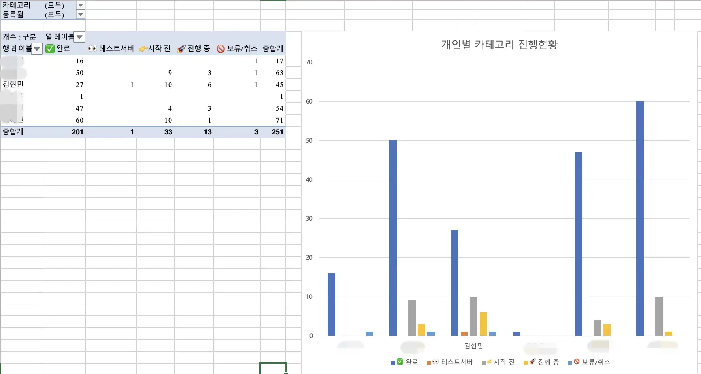
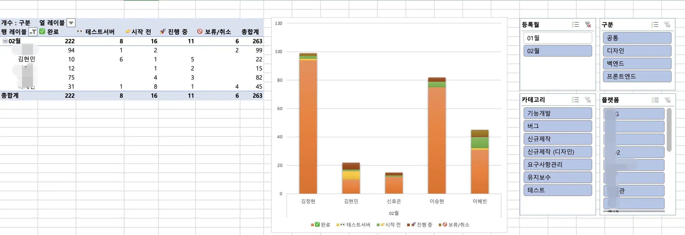
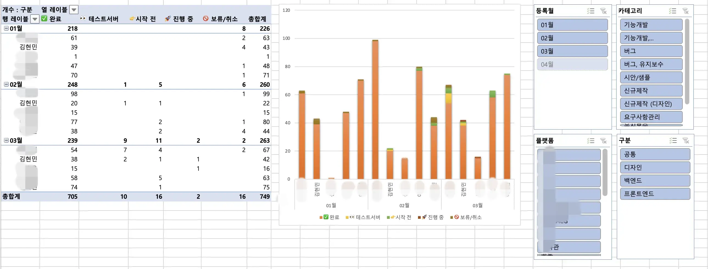

## 새로운 시작: 팀장님의 등장

2025년 1월 7일, 유야무야 시간이 지나고 회사에 조직 개편이 진행되었습니다.

드디어 우리 팀에도 팀장님이 생겼습니다.

[이전 글](/devLog/notion-workflow-1)에서 다뤘던 본부장님용 템플릿을 팀장님께 공유했는데... 썩 마음에 들지 않으신 눈치였습니다.

## 명확한 요구사항

하지만 이번에는 달랐습니다. 팀장님은 본인이 필요한 내용을 **엑셀로 정리해서** 주셨습니다.

원하는 바가 확실히 있으셔서, 전보다 훨씬 수월하게 작업할 수 있었습니다.

### 팀장님의 요구사항

1. **테이블 열 정보** - 어떤 필드가 필요한지 명확히 정의
2. **필드 내용** - 각 필드에 들어갈 데이터 형식 지정
3. **업무 작성 범위 기준** - 최대한 세세하게 작성할 것. 자세할수록 좋다.

## 자동화의 필요성

하지만 모두의 니즈를 충족하려면 **자동화**가 필수였습니다.

### 핵심 자동화 요구사항

1. **업무 현황을 "진행 중"으로 변경** → 시작일자를 자동으로 당시 일자로 적용
2. **업무 현황을 "테스트 서버" 또는 "완료"로 변경** → 종료일자를 변경 당시 일자로 적용
3. **완료 상태가 되면** → 그 건에 대해서 알림을 받고 싶다

### 문제: GUEST 계정의 한계

팀원 모두 **GUEST** 계정이라 노션의 자동화 기능을 사용할 수 없었습니다.

다행히 P&C 팀에 유료 계정을 가진 분이 계셔서, 부탁해서 자동화를 하나씩 붙여나갔습니다.

1, 2번 요구사항은 노션 자체 자동화로 매우 간단하게 해결되었지만, 3번은 별도의 **Slack 앱**이 필요했습니다.

## Firebase Functions를 활용한 Slack 알림 시스템

이전에 배포 요청 시 만들었던 앱을 바탕으로, Firebase Functions를 활용해 만들기로 했습니다.

### 아키텍처

```
Notion 완료 이벤트 → Notion Webhook → Firebase Functions → Slack API → Slack 채널 알림
```

### Firebase를 활용한 Slack 앱 제작 순서

#### 1. Firebase Functions에 배포

먼저 Slack 메시지를 전송할 Firebase Functions 코드를 작성합니다.

```javascript
const functions = require('firebase-functions');
const axios = require('axios');

exports.notionToSlack = functions.https.onRequest(async (req, res) => {
  try {
    const { title, assignee, completedDate, url } = req.body;

    const slackMessage = {
      text: `✅ 업무가 완료되었습니다!`,
      blocks: [
        {
          type: "section",
          text: {
            type: "mrkdwn",
            text: `*${title}*\n담당자: ${assignee}\n완료일: ${completedDate}`
          }
        },
        {
          type: "actions",
          elements: [
            {
              type: "button",
              text: { type: "plain_text", text: "노션에서 보기" },
              url: url
            }
          ]
        }
      ]
    };

    await axios.post(process.env.SLACK_WEBHOOK_URL, slackMessage);

    res.status(200).send('Success');
  } catch (error) {
    console.error('Error:', error);
    res.status(500).send('Error');
  }
});
```

#### 2. Slack API 사이트에서 Webhook 설치 승인

Slack API 포털에서 Incoming Webhook을 활성화하고 채널을 선택합니다.

#### 3. Google IAM에서 접근 권한 설정 (중요!)

**가장 중요한 단계입니다.** 배포된 앱의 접근 권한을 `allUsers` (상수)로 세팅해야 합니다.

노션 Webhook이 Firebase Functions를 호출할 수 있도록 공개 액세스를 허용해야 합니다.

[함수에 대한 액세스 사용 설정 공식 문서](https://cloud.google.com/functions/docs/securing/managing-access-iam?hl=ko#enabling_access_to_a_function)

```bash
# gcloud CLI를 사용한 권한 설정
gcloud functions add-iam-policy-binding notionToSlack \
  --member="allUsers" \
  --role="roles/cloudfunctions.invoker"
```

#### 4. Notion 자동화 Webhook URL 주소에 입력

노션 자동화 설정에서:
- 트리거: 업무 상태가 "완료"로 변경될 때
- 액션: Webhook 호출
- URL: Firebase Functions 배포 URL

#### 5. Slack에 나타낼 정보 선택

필요한 데이터만 파싱해서 Slack으로 전송합니다:
- 업무 제목
- 담당자
- 완료일
- 노션 페이지 링크

## 실제 사용 화면

### 노션 템플릿 최종 버전

아래 '업무 리스트업' 페이지는 전체 DB 테이블을 의미합니다. (팀장님 전용으로 사용되는 테이블)

새로 만들면 기존에 작성한 내용을 모두 일일이 옮겨야 해서, 형태는 제가 제안했던 템플릿을 유지하되 팀장님의 요구사항을 추가했습니다.



_팀장님이 사용하는 전체 업무 대시보드_



_팀원들이 각자 사용하는 업무 기록 페이지_

### Slack 알림 화면



_업무 완료 시 Slack 채널로 전송되는 알림_



_상세 정보와 노션 링크가 포함된 알림 메시지_

## 성과 측정과 피드백

이후 팀장님은 매달 초 각자 진행한 업무들의 개수를 격려의 말씀과 함께 엑셀 파일로 전달해 주셨습니다.



_2월 업무 처리 현황_



_3월 업무 처리 현황_



_4월 업무 처리 현황_

### 정량적 데이터에 대한 고민

상사에게 보고하려면 정량적인 데이터가 필요하고, 유의미한 수치여야 함이 더 중요하다고 생각했습니다.

예를 들어:
- 정확한 데드라인을 지킨 업무 개수
- 데드라인보다 더 빨리 처리한 업무
- 긴급 업무 대응 속도
- 업무 재작업 비율

위의 종합한 숫자들이 유의미한 숫자들인지 의문이 들어 용도를 여쭤보았습니다.

결론은 **"이 정도 했다"를 보여주기 위한 용도**였습니다.

~~대표님에게 수고했다고 듣기 위한 용도라고 본인이 말씀하셨습니다.~~

그래, 일단 이렇게 마무리하자.

## 기술 스택 정리

### 사용 기술

- **Notion API** - 데이터베이스 및 Webhook
- **Firebase Functions** - 서버리스 백엔드
- **Slack Incoming Webhooks** - 메시지 전송
- **Google Cloud IAM** - 접근 권한 관리
- **Node.js** - 런타임 환경

### 주요 개념

**Webhook이란?**
- 특정 이벤트가 발생했을 때 다른 애플리케이션에 자동으로 데이터를 전송하는 방식
- 실시간 알림과 자동화에 필수적인 기술

**서버리스 아키텍처**
- 서버 관리 없이 코드만 배포하여 실행
- 사용한 만큼만 비용 지불
- Firebase Functions가 대표적인 서버리스 플랫폼

## 회고

### 배운 점

1. **명확한 요구사항의 가치**
   - 엑셀로 정리된 명확한 요구사항이 얼마나 소중한지 깨달았습니다.
   - 이전 본부장님 때와는 비교할 수 없을 정도로 개발이 수월했습니다.

2. **자동화의 중요성**
   - 수작업으로 관리하던 일자 입력을 자동화하니 실제 사용률이 크게 증가했습니다.
   - 완료 알림으로 팀 내 업무 가시성이 향상되었습니다.

3. **도구 간 연동**
   - Notion → Firebase → Slack 연동으로 강력한 워크플로우를 구축할 수 있었습니다.
   - 각 도구의 강점을 살린 통합이 생산성을 극대화합니다.

4. **IAM 권한 관리**
   - 공개 액세스가 필요한 경우 보안과 접근성의 균형을 맞춰야 합니다.
   - Google Cloud IAM 설정이 Webhook 연동의 핵심이었습니다.

### 아쉬운 점

- 정량적 지표가 실제 업무 품질을 반영하지 못하는 한계
- 단순 업무 개수보다는 가치 중심의 측정이 필요
- 여전히 GUEST 계정의 제약으로 고급 자동화는 제한적

### 개선 아이디어

1. **업무 완료 기준 명확화**
   - 고객 승인, 내부 검토 등 단계별 세분화

2. **더 의미 있는 지표 도입**
   - 업무 처리 시간 (데드라인 대비)
   - 재작업 비율 추적
   - 긴급 업무 대응 속도

3. **알림 개선**
   - 업무 지연 알림
   - 주간 요약 리포트
   - 담당자별 업무 부하 현황

---

**시리즈 글**
- [노션 업무 템플릿 개발기 #1 - 팀 생산성을 위한 템플릿 설계](/devLog/notion-workflow-1)
- 노션 업무 템플릿 개발기 #2 - Slack 연동 자동화 (현재 글)

## 참고 자료

- [Notion API Documentation](https://developers.notion.com/)
- [Firebase Functions 가이드](https://firebase.google.com/docs/functions)
- [Slack Incoming Webhooks](https://api.slack.com/messaging/webhooks)
- [Google Cloud IAM 권한 관리](https://cloud.google.com/functions/docs/securing/managing-access-iam)
