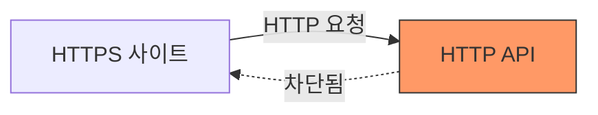

# 🔒 Netlify Mixed Content 에러 해결하기: HTTPS에서 HTTP API 호출 문제

Netlify에 배포한 후 갑자기 API 호출이 안 된다면? HTTPS와 HTTP 프로토콜 충돌로 인한 Mixed Content 에러일 가능성이 높습니다. Proxy를 활용한 해결 방법을 소개합니다.

## 🚨 문제 상황

Netlify에 사이트를 배포하고 접속했더니 다음과 같은 에러가 발생했습니다.

```
Mixed Content: The page at 'https://...' was loaded over HTTPS, 
but requested an insecure resource 'http://...'. 
This request has been blocked; the content must be served over HTTPS.
```

### 문제 원인

- **오픈 API 프로토콜**: HTTP
- **배포된 도메인 프로토콜**: HTTPS
- **브라우저 보안 정책**: HTTPS → HTTP 요청 차단



## 🤔 해결 방법 검토

### 1. 서버 측 HTTPS 지원 (이상적)

Netlify 공식 답변에 따르면 API 서버에서 HTTPS를 지원하도록 수정하는 것이 가장 좋은 방법입니다.

**장점:**
- 근본적인 해결
- 보안성 향상

**단점:**
- 외부 API(공공데이터 포털 등)는 수정 불가능
- 서버 제어권이 없는 경우 적용 불가

### 2. Proxy 사용 (현실적 해결책) ✅

프록시 서버를 통해 HTTPS → HTTPS → HTTP 경로로 우회하여 요청합니다.

```
클라이언트(HTTPS) → 프록시(HTTPS) → API 서버(HTTP)
```

## ✅ 해결 방법: Vite + Netlify Proxy 설정

### Step 1: Vite 개발 서버 Proxy 설정

로컬 개발 환경에서 프록시를 구성합니다.

**vite.config.ts**

```typescript
import { defineConfig } from 'vite';

export default defineConfig({
  server: {
    proxy: {
      '/api': {
        target: 'http://openapi.seoul.go.kr:8088',
        changeOrigin: true,
        rewrite: (path) => path.replace(/^\/api/, ''),
      },
    },
  },
});
```

**설정 설명:**

| 옵션 | 설명 |
|------|------|
| `target` | 실제 API 서버 주소 |
| `changeOrigin` | Host 헤더를 target URL로 변경 |
| `rewrite` | `/api` 프리픽스 제거 후 전달 |

### Step 2: API 호출 코드 수정

기존 절대 경로를 상대 경로로 변경합니다.

**Before (에러 발생):**

```typescript
// ❌ 직접 HTTP 호출
fetch('http://openapi.seoul.go.kr:8088/KEY/json/DATA/1/100')
```

**After (정상 동작):**

```typescript
// ✅ 프록시를 통한 호출
fetch('/api/KEY/json/DATA/1/100')
```

### Step 3: Netlify Redirects 설정

Netlify 배포 환경에서도 프록시가 작동하도록 설정합니다.

**netlify.toml** (프로젝트 루트에 생성)

```toml
[[redirects]]
  from = "/api/*"
  to = "http://openapi.seoul.go.kr:8088/:splat"
  status = 200
  force = true
```

**또는 _redirects 파일 사용**

프로젝트 루트 또는 `public` 폴더에 `_redirects` 파일 생성:

```
/api/*  http://openapi.seoul.go.kr:8088/:splat  200
```

**설정 설명:**

| 옵션 | 설명 |
|------|------|
| `from` | 클라이언트 요청 경로 패턴 |
| `to` | 프록시할 실제 API 주소 |
| `:splat` | 와일드카드 경로를 그대로 전달 |
| `status = 200` | 프록시 모드 (리다이렉트 아님) |

## 📂 전체 파일 구조

```
project/
├── vite.config.ts          # Vite 개발 서버 프록시 설정
├── netlify.toml            # Netlify 프록시 설정 (옵션 1)
├── public/
│   └── _redirects          # Netlify 프록시 설정 (옵션 2)
└── src/
    └── api/
        └── index.ts        # API 호출 코드
```

## 🔍 동작 흐름

### 개발 환경 (localhost)

```
브라우저 → fetch('/api/...') 
  → Vite Dev Server (프록시) 
  → http://openapi.seoul.go.kr:8088/...
```

### 프로덕션 환경 (Netlify)

```
브라우저 → fetch('/api/...') 
  → Netlify Edge (프록시) 
  → http://openapi.seoul.go.kr:8088/...
```

## ✨ 결과 확인

프록시 설정 후:
- ✅ Mixed Content 에러 해결
- ✅ API 데이터 정상 수신
- ✅ 개발/배포 환경 모두 동일한 코드 사용

### 브라우저 콘솔 확인

**Before:**
```
❌ Mixed Content: The page at 'https://...' was loaded over HTTPS...
```

**After:**
```
✅ GET /api/KEY/json/DATA/1/100 200 OK
```

## ⚠️ 주의사항

### 1. CORS 정책

일부 API 서버는 특정 Origin만 허용할 수 있습니다. 프록시를 사용하면 서버 측에서는 Netlify의 IP를 Origin으로 인식합니다.

### 2. API 키 보안

```typescript
// ❌ 나쁜 예: 클라이언트에 API 키 노출
const API_KEY = 'my-secret-key-12345';

// ✅ 좋은 예: 환경 변수 사용
const API_KEY = import.meta.env.VITE_API_KEY;
```

**.env**
```
VITE_API_KEY=your-api-key-here
```

### 3. Rate Limiting

프록시를 통한 모든 요청이 Netlify 서버에서 나가므로 API Rate Limit에 주의해야 합니다.

### 4. netlify.toml vs _redirects

| 파일 | 우선순위 | 권장 용도 |
|------|---------|----------|
| `netlify.toml` | 높음 | 복잡한 설정, 다중 환경 |
| `_redirects` | 낮음 | 간단한 리다이렉트 |

**둘 다 있으면 `netlify.toml`이 우선 적용됩니다.**

## 🎯 대안: Netlify Functions

더 복잡한 로직이 필요하다면 Netlify Functions를 사용할 수 있습니다.

```typescript
// netlify/functions/api.ts
import type { Handler } from '@netlify/functions';

export const handler: Handler = async (event) => {
  const response = await fetch(
    `http://openapi.seoul.go.kr:8088${event.path}`
  );
  const data = await response.json();
  
  return {
    statusCode: 200,
    body: JSON.stringify(data),
  };
};
```

**장점:**
- 서버 측 로직 추가 가능
- API 키 완전히 숨김 가능
- 데이터 변환/필터링 가능

**단점:**
- 설정이 복잡함
- Cold Start 지연 발생 가능

## 📊 성능 비교

| 방법 | 응답 속도 | 설정 난이도 | 보안성 |
|------|----------|-----------|--------|
| 직접 HTTP 호출 | 빠름 | 쉬움 | ❌ 차단됨 |
| Netlify Redirects | 빠름 | 쉬움 | ✅ 양호 |
| Netlify Functions | 중간 | 어려움 | ✅ 우수 |

## 🎓 배운 점

1. **Mixed Content 정책**: 브라우저는 HTTPS 페이지에서 HTTP 리소스 로딩을 차단
2. **프록시 패턴**: 프로토콜 불일치 문제를 우회하는 효과적인 방법
3. **환경별 설정**: 개발(Vite)과 배포(Netlify) 환경에 맞는 프록시 설정 필요

## 🔗 참고 자료

- [Netlify Redirects 공식 문서](https://docs.netlify.com/routing/redirects/)
- [Vite 서버 프록시 설정](https://vitejs.dev/config/server-options.html#server-proxy)
- [MDN Mixed Content 가이드](https://developer.mozilla.org/en-US/docs/Web/Security/Mixed_content)

프록시 설정을 통해 Mixed Content 에러를 깔끔하게 해결했습니다! 비슷한 문제를 겪고 계시다면 이 방법을 시도해보세요. 🚀
